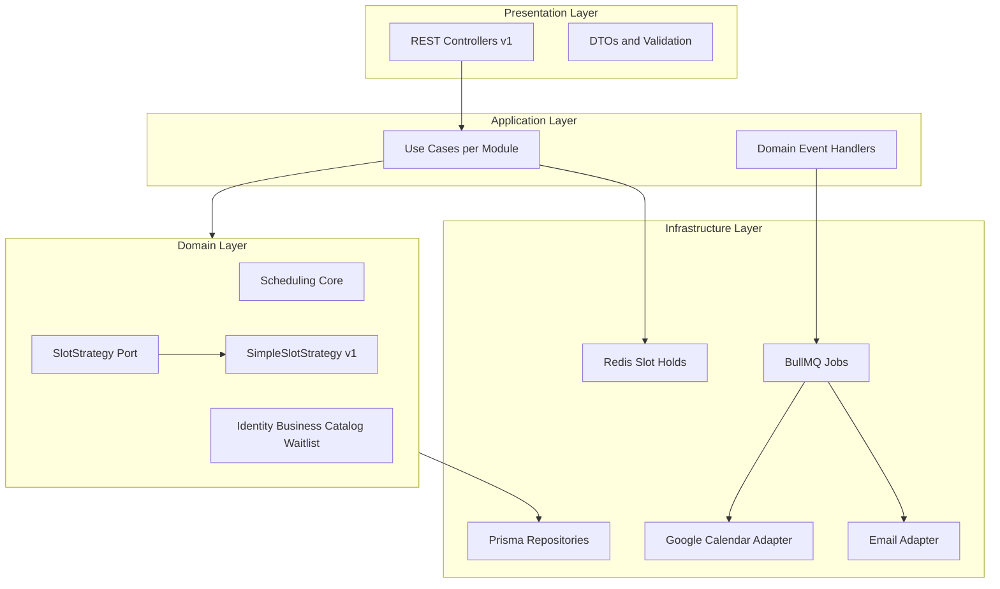
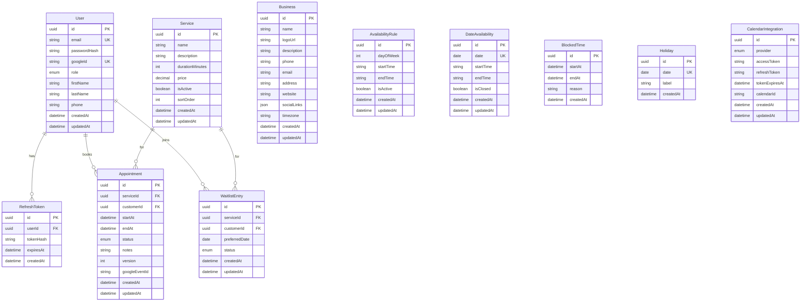
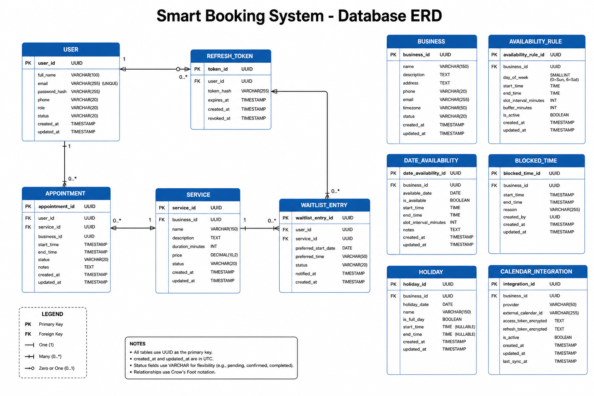
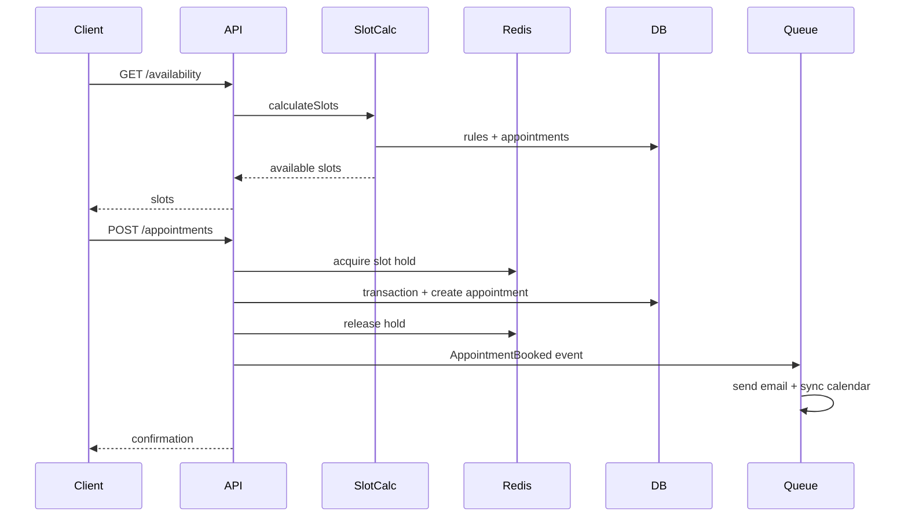
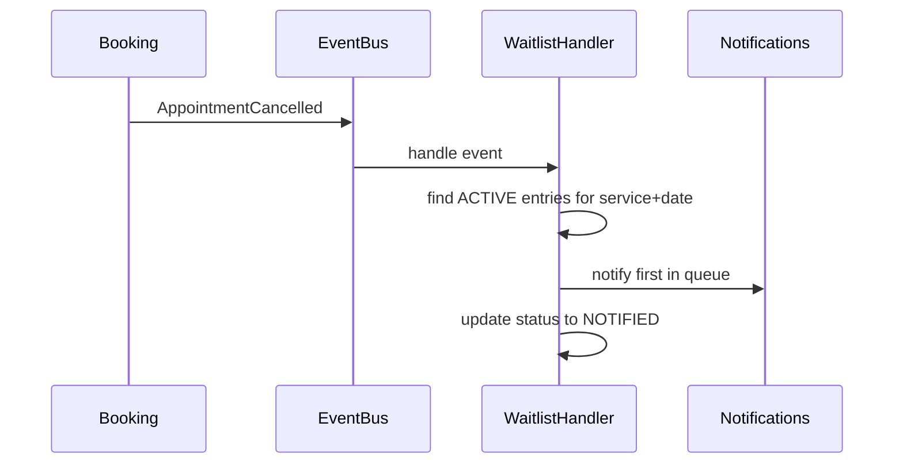

# Smart Booking System — תוכנית Backend v1

> מסמך תכנון מלא ל-Backend v1.  
> **שלב 1 (Scaffold) בביצוע — שלבים 2–9 ממתינים לאישור.**

---

## תוכן עניינים

1. [מטרת ה-Backend](#1-מטרת-ה-backend)
2. [User Stories](#2-user-stories)
3. [Non Functional Requirements](#3-non-functional-requirements)
4. [הארכיטקטורה שנבחרה](#4-הארכיטקטורה-שנבחרה)
5. [Architecture Decisions](#5-architecture-decisions)
6. [מבנה התיקיות המלא](#6-מבנה-התיקיות-המלא)
7. [כל ה-Entities במסד הנתונים](#7-כל-ה-entities-במסד-הנתונים)
8. [ERD](#8-erd)
9. [כל ה-API Endpoints](#9-כל-ה-api-endpoints)
10. [מודל הזמינות הדינמית](#10-מודל-הזמינות-הדינמית)
11. [רשימת המתנה](#11-רשימת-המתנה)
12. [Google Calendar / ICS Integration](#12-google-calendar--ics-integration)
13. [Notifications](#13-notifications)
14. [מה נכנס ל-v1](#14-מה-נכנס-ל-v1)
15. [מה נשאר לעתיד](#15-מה-נשאר-לעתיד)
16. [סדר ביצוע בשלבים](#16-סדר-ביצוע-בשלבים)
17. [הערות חשובות](#17-הערות-חשובות)

---

## 1. מטרת ה-Backend

Smart Booking System היא מערכת **גנרית לניהול וקביעת תורים** עבור עסקים מבוססי שירותים (מספרות, קוסמטיקאיות, מטפלים, מאמנים וכו').

### עקרונות מרכזיים

| עקרון | פירוט |
|-------|--------|
| **Single-tenant** | כל התקנה מיועדת לעסק **אחד** — לא marketplace |
| **זמינות דינמית** | המערכת **לא** מניחה שעות פעילות קבועות |
| **ליבה עסקית** | Scheduling הוא הדומיין הקריטי — לא CRUD פשוט |
| **הרחבה עתידית** | תכנון מראש לאלגוריתם שיבוץ חכם, AI, עובדים, סניפים |

### מטרות v1

- לאפשר ל**לקוחות** להירשם, לצפות בזמינות, לקבוע/לבטל/לשנות תורים, ולהצטרף לרשימת המתנה
- לאפשר ל**בעל העסק** לנהל פרטי עסק, שירותים, זמינות, יומן, לקוחות ורשימת המתנה
- לשלוח **התראות מייל** על קביעה וביטול תור
- לסנכרן תורים ל-**Google Calendar** ולייצא **ICS**
- למנוע **double-booking** תחת עומס

### Tech Stack

| רכיב | בחירה |
|------|--------|
| שפה | TypeScript |
| Framework | NestJS |
| DB | PostgreSQL 16 |
| ORM | Prisma |
| Cache | Redis 7 |
| Queue | BullMQ |
| Auth | Passport.js + JWT |
| Email | Nodemailer (SMTP) |
| Calendar | Google Calendar API |
| Package manager | npm |
| API Docs | Swagger (`/api/docs`) |

---

## 2. User Stories

### לקוח (CUSTOMER)

| ID | User Story | קריטריוני קבלה |
|----|------------|----------------|
| US-C01 | **כלקוח**, אני רוצה להירשם עם אימייל וסיסמה, **כדי** לקבוע תורים במערכת | הרשמה מצליחה, מתקבל JWT, נוצר משתמש עם role CUSTOMER |
| US-C02 | **כלקוח**, אני רוצה להתחבר עם Google, **כדי** לא להקליד סיסמה | OAuth flow מלא, משתמש נוצר/מזוהה לפי googleId |
| US-C03 | **כלקוח**, אני רוצה לראות שירותים פעילים של העסק, **כדי** לבחור מה להזמין | `GET /services` מחזיר רק שירותים עם isActive=true |
| US-C04 | **כלקוח**, אני רוצה לראות שעות פנויות לתאריך ושירות, **כדי** לבחור מועד נוח | `GET /availability` מחזיר slots לפי זמינות דינמית ומשך השירות |
| US-C05 | **כלקוח**, אני רוצה לקבוע תור לשעה שנבחרה, **כדי** להבטיח את מקומי | תור נוצר, נשלח מייל אישור, לא ניתן לקבוע אותו slot פעמיים |
| US-C06 | **כלקוח**, אני רוצה לראות את התורים העתידיים והקודמים שלי, **כדי** לעקוב אחרי ההזמנות | `GET /me/appointments` עם פילטר status/from/to |
| US-C07 | **כלקוח**, אני רוצה לבטל תור, **כדי** לשחרר את השעה אם לא אוכל להגיע | סטטוס → CANCELLED, מייל אישור, slot מתפנה |
| US-C08 | **כלקוח**, אני רוצה לשנות מועד תור, **כדי** להתאים ללוח הזמנים שלי | reschedule ל-slot פנוי, מייל עדכון |
| US-C09 | **כלקוח**, אני רוצה להצטרף לרשימת המתנה כשאין תורים, **כדי** לקבל התראה כשמתפנה מקום | רשומה ב-WaitlistEntry, סטטוס ACTIVE |
| US-C10 | **כלקוח**, אני רוצה להוריד קובץ ICS לתור, **כדי** להוסיף ליומן המכשיר | `GET /appointments/:id/ics` מחזיר VEVENT תקין |

### בעל עסק (OWNER)

| ID | User Story | קריטריוני קבלה |
|----|------------|----------------|
| US-O01 | **כבעל עסק**, אני רוצה לעדכן פרטי עסק (שם, טלפון, תיאור), **כדי** שלקוחות יראו מידע מעודכן | `PUT /business` שומר ומחזיר את הפרטים |
| US-O02 | **כבעל עסק**, אני רוצה להעלות לוגו, **כדי** למתג את העסק | `POST /business/logo` שומר URL ומחזיר אותו |
| US-O03 | **כבעל עסק**, אני רוצה לנהל שירותים (שם, משך, מחיר), **כדי** להציע ללקוחות את מה שאני מספק | CRUD מלא ב-`/admin/services` |
| US-O04 | **כבעל עסק**, אני רוצה להגדיר זמינות שבועית ולפי תאריך, **כדי** לשלוט מתי ניתן לקבוע תורים | rules + date overrides עובדים ב-SlotCalculator |
| US-O05 | **כבעל עסק**, אני רוצה לחסום שעות ולהגדיר חופשות, **כדי** למנוע קביעת תורים בזמנים לא זמינים | BlockedTime + Holiday משפיעים על slots |
| US-O06 | **כבעל עסק**, אני רוצה לראות את יומן התורים (היום / עתיד), **כדי** לתכנן את היום | `GET /admin/appointments` עם פילטרים |
| US-O07 | **כבעל עסק**, אני רוצה לבטל תור מצד הניהול, **כדי** לטפל בביטולים טלפוניים | cancel מצד owner, מייל ללקוח |
| US-O08 | **כבעל עסק**, אני רוצה לראות רשימת לקוחות והיסטוריה, **כדי** לנהל קשר עם לקוחות | `GET /admin/customers` + `/:id` |
| US-O09 | **כבעל עסק**, אני רוצה לראות רשימת המתנה, **כדי** לדעת מי מחכה לתור | `GET /admin/waitlist` |
| US-O10 | **כבעל עסק**, אני רוצה לחבר Google Calendar, **כדי** שתורים יסתנכרנו אוטומטית | OAuth + sync על AppointmentBooked/Cancelled |

### מערכת (System)

| ID | User Story | קריטריוני קבלה |
|----|------------|----------------|
| US-S01 | **המערכת** שולחת מייל אישור בקביעת תור | BullMQ job + template HTML |
| US-S02 | **המערכת** שולחת מייל אישור בביטול תור | BullMQ job + template HTML |
| US-S03 | **המערכת** מודיעה לרשימת המתנה כשמתפנה slot | handler על AppointmentCancelled |
| US-S04 | **המערכת** מונעת double-booking תחת בקשות מקבילות | transaction + version + Redis hold |

---

## 3. Non Functional Requirements

### ביצועים (Performance)

| ID | דרישה | יעד |
|----|--------|-----|
| NFR-P01 | זמן תגובה ל-`GET /availability` | < 500ms (p95) לטווח יום בודד |
| NFR-P02 | זמן תגובה ל-`POST /appointments` | < 1s (p95) כולל transaction |
| NFR-P03 | זמן תגובה ל-endpoints קריאה פשוטים | < 200ms (p95) |
| NFR-P04 | תמיכה במשתמשים מקבילים | 50 בקשות קביעה בו-זמנית ללא double-booking |

### אבטחה (Security)

| ID | דרישה | יעד |
|----|--------|-----|
| NFR-S01 | אימות | JWT access + refresh tokens |
| NFR-S02 | הרשאות | Role-based: CUSTOMER / OWNER |
| NFR-S03 | סיסמאות | bcrypt hashing, לעולם לא נשמרות ב-plain text |
| NFR-S04 | OAuth tokens (Calendar) | מוצפנים ב-DB (EncryptionService) |
| NFR-S05 | Input validation | class-validator על כל DTO |
| NFR-S06 | HTTPS | חובה ב-production |

### זמינות ואמינות (Availability & Reliability)

| ID | דרישה | יעד |
|----|--------|-----|
| NFR-A01 | Health check | `GET /health` בודק DB + Redis |
| NFR-A02 | Email delivery | retry אוטומטי דרך BullMQ (3 ניסיונות) |
| NFR-A03 | Calendar sync | retry אסינכרוני, כשל לא מבטל את התור |
| NFR-A04 | Graceful shutdown | NestJS lifecycle hooks לסגירת connections |

### סקלאביליות (Scalability)

| ID | דרישה | יעד |
|----|--------|-----|
| NFR-SC01 | ארכיטקטורה | Modular Monolith — ניתן לפצל מודולים בעתיד |
| NFR-SC02 | Stateless API | JWT בלבד, ללא session server-side (מלבד refresh tokens) |
| NFR-SC03 | Queue workers | BullMQ — ניתן להריץ workers נפרדים |

### תחזוקה (Maintainability)

| ID | דרישה | יעד |
|----|--------|-----|
| NFR-M01 | Clean Architecture | domain ללא תלות ב-framework |
| NFR-M02 | API documentation | Swagger מעודכן אוטומטית |
| NFR-M03 | DB migrations | Prisma migrate — כל שינוי schema בגרסה |
| NFR-M04 | Type safety | TypeScript strict mode |
| NFR-M05 | Testability | unit tests ל-domain, integration ל-booking flow |

### תאימות (Compatibility)

| ID | דרישה | יעד |
|----|--------|-----|
| NFR-C01 | Timezone | תמיכה ב-timezone עסק (default Asia/Jerusalem) |
| NFR-C02 | ICS | תקן RFC 5545 (VEVENT) |
| NFR-C03 | Google Calendar API | v3 |

### ניטור (Observability)

| ID | דרישה | יעד |
|----|--------|-----|
| NFR-O01 | Structured logging | NestJS Logger + request context |
| NFR-O02 | Error handling | global exception filter עם קודי שגיאה עקביים |

---

## 4. הארכיטקטורה שנבחרה

### Modular Monolith + Clean/Hexagonal Architecture + DDD



### כלל תלות

```
presentation → application → domain ← infrastructure
```

**ה-Domain Layer לא מייבא NestJS, Prisma או ספריות חיצוניות.**

### Bounded Contexts (מודולים)

```
┌─────────────────────────────────────────────────────────┐
│                    Smart Booking Backend                 │
├─────────────┬─────────────┬──────────────┬──────────────┤
│   Identity  │   Business  │   Catalog    │  Scheduling  │
│   & Access  │   Profile   │  (Services)  │  (CORE)      │
├─────────────┼─────────────┼──────────────┼──────────────┤
│  Customers  │  Waitlist   │ Notifications│ Integrations │
└─────────────┴─────────────┴──────────────┴──────────────┘
```

| Context | אחריות |
|---------|--------|
| **identity** | הרשמה, login, OAuth, JWT, roles (CUSTOMER / OWNER) |
| **business** | פרטי עסק, לוגו, הגדרות |
| **catalog** | שירותים (משך, מחיר, סטטוס) |
| **scheduling** | זמינות, slots, תורים, ביטול/שינוי — **הליבה** |
| **customers** | פרופיל לקוח, היסטוריה (admin views) |
| **waitlist** | הצטרפות, ניהול, התראה כשמתפנה slot |
| **notifications** | מיילים (v1), עתידית SMS/WhatsApp |
| **integrations** | Google Calendar, ICS export |

### למה לא Microservices ב-v1?

- עסק אחד להתקנה, צוות קטן
- פחות operational overhead
- מודולריות טובה מאפשרת פיצול בעתיד אם צריך

### Domain Events

```
AppointmentBooked    → [SendEmail, SyncGoogleCalendar]
AppointmentCancelled → [SendEmail, FreeSlot, NotifyWaitlist]
AppointmentRescheduled → [SendEmail, UpdateGoogleCalendar]
```

---

## 5. Architecture Decisions

רשומות החלטה ארכיטקטוניות (ADR) לפרויקט.

| # | החלטה | אלטרנטיבות שנשקלו | נימוק | השלכות |
|---|--------|-------------------|--------|---------|
| ADR-01 | **TypeScript + NestJS** | Python/FastAPI, Go | אקוסיסטם מלא, type safety, אחידות עם frontend עתידי | DI מובנה, מבנה מודולרי |
| ADR-02 | **Modular Monolith** | Microservices | single-tenant, צוות קטן, פחות ops | מודולים עם boundaries, פיצול אפשרי בעתיד |
| ADR-03 | **Clean/Hexagonal Architecture** | Layered MVC פשוט | domain נקי, testable, מוכן ל-SlotStrategy plug-in | יותר קבצים, boilerplate מבוקר |
| ADR-04 | **PostgreSQL** | MySQL, MongoDB | transactions, row locking, `tstzrange`, אמינות | דורש migrations (Prisma) |
| ADR-05 | **Prisma ORM** | TypeORM, Drizzle | type-safe, DX מעולה, migrations | פחות גמישות ב-queries מורכבים |
| ADR-06 | **Redis** לslot holds | DB locks בלבד | TTL מהיר, פחות עומס על DB בזמן checkout | תלות ב-Redis נוסף |
| ADR-07 | **BullMQ** לasync jobs | in-process events | retry, persistence, workers נפרדים | Redis חובה |
| ADR-08 | **JWT + Refresh Token** | Session cookies | stateless API, מתאים ל-mobile | ניהול refresh tokens ב-DB |
| ADR-09 | **Single-tenant** (ללא tenant_id) | multi-tenant schema | התקנה לעסק אחד לפי PRD | פשטות; multi-tenant = refactor גדול |
| ADR-10 | **UTC ב-DB** | local time ב-DB | best practice, DST-safe | המרה ב-presentation בלבד |
| ADR-11 | **SlotStrategy port** | לוגיקה inline ב-use case | החלפת אלגוריתם בלי לשנות use cases | interface + DI registration |
| ADR-12 | **Domain Events** | קריאות ישירות בין מודולים | decoupling scheduling ↔ notifications/integrations | event handlers + queue |
| ADR-13 | **REST API** (`/api/v1`) | GraphQL | פשוט, מתאים ל-v1, Swagger | over-fetching אפשרי בעתיד |
| ADR-14 | **Nodemailer (SMTP)** | SendGrid, SES | גמיש, ללא vendor lock ב-v1 | דורש SMTP server |
| ADR-15 | **Local file storage** ללוגו | S3 מיידי | פשוט ל-v1, `StoragePort` להחלפה | לא מתאים ל-production scale |

### החלטות שלא נלקחו ב-v1 (מכוון)

| החלטה | מתי לשקול מחדש |
|--------|----------------|
| Microservices | > 1 צוות, צורך scale עצמאי למודול |
| GraphQL | frontend מורכב עם over-fetching |
| SmartSlotStrategy | לאחר איסוף נתוני שימוש |
| Multi-tenant | מעבר למודל marketplace / SaaS |

---

## 6. מבנה התיקיות המלא

```
backend/
├── .env.example
├── .gitignore
├── docker-compose.yml
├── nest-cli.json
├── package.json
├── tsconfig.json
├── tsconfig.build.json
├── jest.config.js
│
├── prisma/
│   ├── schema.prisma
│   └── migrations/
│
├── test/
│   ├── jest-e2e.json
│   ├── e2e/
│   │   ├── auth.e2e-spec.ts
│   │   ├── booking.e2e-spec.ts
│   │   └── health.e2e-spec.ts
│   └── helpers/
│       └── test-db.helper.ts
│
└── src/
    ├── main.ts
    ├── app.module.ts
    │
    ├── shared/
    │   ├── domain/
    │   │   ├── value-objects/
    │   │   │   ├── time-slot.vo.ts
    │   │   │   ├── date-range.vo.ts
    │   │   │   └── money.vo.ts
    │   │   ├── events/
    │   │   │   └── domain-event.base.ts
    │   │   └── enums/
    │   │       ├── user-role.enum.ts
    │   │       ├── appointment-status.enum.ts
    │   │       └── waitlist-status.enum.ts
    │   ├── application/
    │   │   └── event-bus.port.ts
    │   ├── infrastructure/
    │   │   ├── database/
    │   │   │   ├── prisma.module.ts
    │   │   │   └── prisma.service.ts
    │   │   ├── cache/
    │   │   │   ├── redis.module.ts
    │   │   │   └── redis.service.ts
    │   │   ├── queue/
    │   │   │   ├── bullmq.module.ts
    │   │   │   └── queue.constants.ts
    │   │   └── crypto/
    │   │       └── encryption.service.ts
    │   └── presentation/
    │       ├── filters/
    │       │   └── http-exception.filter.ts
    │       ├── pipes/
    │       │   └── validation.pipe.ts
    │       ├── decorators/
    │       │   ├── current-user.decorator.ts
    │       │   └── roles.decorator.ts
    │       ├── guards/
    │       │   └── roles.guard.ts
    │       └── dto/
    │           └── pagination.dto.ts
    │
    └── modules/
        │
        ├── identity/
        │   ├── identity.module.ts
        │   ├── domain/
        │   │   ├── entities/
        │   │   │   └── user.entity.ts
        │   │   └── ports/
        │   │       └── user.repository.port.ts
        │   ├── application/
        │   │   ├── register.use-case.ts
        │   │   ├── login.use-case.ts
        │   │   ├── refresh-token.use-case.ts
        │   │   └── get-me.use-case.ts
        │   ├── infrastructure/
        │   │   ├── persistence/
        │   │   │   └── prisma-user.repository.ts
        │   │   ├── auth/
        │   │   │   ├── jwt.strategy.ts
        │   │   │   ├── google.strategy.ts
        │   │   │   └── jwt-auth.guard.ts
        │   │   └── hashing/
        │   │       └── bcrypt.service.ts
        │   └── presentation/
        │       ├── auth.controller.ts
        │       └── dto/
        │           ├── register.dto.ts
        │           ├── login.dto.ts
        │           └── auth-response.dto.ts
        │
        ├── business/
        │   ├── business.module.ts
        │   ├── domain/
        │   │   ├── entities/
        │   │   │   └── business.entity.ts
        │   │   └── ports/
        │   │       ├── business.repository.port.ts
        │   │       └── storage.port.ts
        │   ├── application/
        │   │   ├── get-business.use-case.ts
        │   │   ├── update-business.use-case.ts
        │   │   └── upload-logo.use-case.ts
        │   ├── infrastructure/
        │   │   ├── persistence/
        │   │   │   └── prisma-business.repository.ts
        │   │   └── storage/
        │   │       └── local-storage.adapter.ts
        │   └── presentation/
        │       ├── business.controller.ts
        │       └── dto/
        │           └── update-business.dto.ts
        │
        ├── catalog/
        │   ├── catalog.module.ts
        │   ├── domain/
        │   │   ├── entities/
        │   │   │   └── service.entity.ts
        │   │   └── ports/
        │   │       └── service.repository.port.ts
        │   ├── application/
        │   │   ├── list-services.use-case.ts
        │   │   ├── create-service.use-case.ts
        │   │   ├── update-service.use-case.ts
        │   │   └── delete-service.use-case.ts
        │   ├── infrastructure/
        │   │   └── persistence/
        │   │       └── prisma-service.repository.ts
        │   └── presentation/
        │       ├── services.controller.ts
        │       ├── admin-services.controller.ts
        │       └── dto/
        │           ├── create-service.dto.ts
        │           └── update-service.dto.ts
        │
        ├── scheduling/                          # CORE
        │   ├── scheduling.module.ts
        │   ├── domain/
        │   │   ├── entities/
        │   │   │   ├── appointment.entity.ts
        │   │   │   ├── availability-rule.entity.ts
        │   │   │   ├── date-availability.entity.ts
        │   │   │   ├── blocked-time.entity.ts
        │   │   │   └── holiday.entity.ts
        │   │   ├── services/
        │   │   │   ├── slot-calculator.service.ts
        │   │   │   └── booking.service.ts
        │   │   ├── ports/
        │   │   │   ├── appointment.repository.port.ts
        │   │   │   ├── availability.repository.port.ts
        │   │   │   ├── slot-hold.port.ts
        │   │   │   └── slot-strategy.port.ts      # לאלגוריתם חכם עתידי
        │   │   └── events/
        │   │       ├── appointment-booked.event.ts
        │   │       ├── appointment-cancelled.event.ts
        │   │       └── appointment-rescheduled.event.ts
        │   ├── application/
        │   │   ├── get-available-slots.use-case.ts
        │   │   ├── book-appointment.use-case.ts
        │   │   ├── cancel-appointment.use-case.ts
        │   │   ├── reschedule-appointment.use-case.ts
        │   │   ├── list-my-appointments.use-case.ts
        │   │   ├── list-admin-appointments.use-case.ts
        │   │   ├── set-availability-rule.use-case.ts
        │   │   ├── set-date-availability.use-case.ts
        │   │   ├── create-blocked-time.use-case.ts
        │   │   └── create-holiday.use-case.ts
        │   ├── infrastructure/
        │   │   ├── persistence/
        │   │   │   ├── prisma-appointment.repository.ts
        │   │   │   └── prisma-availability.repository.ts
        │   │   ├── cache/
        │   │   │   └── redis-slot-hold.adapter.ts
        │   │   └── strategies/
        │   │       └── simple-slot.strategy.ts    # v1 בלבד
        │   └── presentation/
        │       ├── availability.controller.ts
        │       ├── appointments.controller.ts
        │       ├── admin-appointments.controller.ts
        │       ├── admin-availability.controller.ts
        │       └── dto/
        │           ├── get-availability.query.dto.ts
        │           ├── book-appointment.dto.ts
        │           ├── reschedule-appointment.dto.ts
        │           ├── set-availability-rule.dto.ts
        │           ├── set-date-availability.dto.ts
        │           ├── create-blocked-time.dto.ts
        │           └── create-holiday.dto.ts
        │
        ├── customers/
        │   ├── customers.module.ts
        │   ├── application/
        │   │   ├── list-customers.use-case.ts
        │   │   └── get-customer.use-case.ts
        │   ├── infrastructure/
        │   │   └── persistence/
        │   │       └── prisma-customer.repository.ts
        │   └── presentation/
        │       ├── admin-customers.controller.ts
        │       └── dto/
        │           └── customer-response.dto.ts
        │
        ├── waitlist/
        │   ├── waitlist.module.ts
        │   ├── domain/
        │   │   ├── entities/
        │   │   │   └── waitlist-entry.entity.ts
        │   │   └── ports/
        │   │       └── waitlist.repository.port.ts
        │   ├── application/
        │   │   ├── join-waitlist.use-case.ts
        │   │   ├── list-waitlist.use-case.ts
        │   │   └── process-waitlist-on-cancel.handler.ts
        │   ├── infrastructure/
        │   │   └── persistence/
        │   │       └── prisma-waitlist.repository.ts
        │   └── presentation/
        │       ├── waitlist.controller.ts
        │       ├── admin-waitlist.controller.ts
        │       └── dto/
        │           └── join-waitlist.dto.ts
        │
        ├── notifications/
        │   ├── notifications.module.ts
        │   ├── domain/
        │   │   └── ports/
        │   │       └── email.port.ts
        │   ├── application/
        │   │   ├── send-booking-confirmation.handler.ts
        │   │   └── send-cancellation-confirmation.handler.ts
        │   └── infrastructure/
        │       ├── email/
        │       │   └── nodemailer.adapter.ts
        │       ├── queue/
        │       │   ├── email.processor.ts
        │       │   └── email.job.types.ts
        │       └── templates/
        │           ├── booking-confirmation.template.ts
        │           └── cancellation-confirmation.template.ts
        │
        └── integrations/
            ├── integrations.module.ts
            ├── domain/
            │   └── ports/
            │       └── calendar.port.ts
            ├── application/
            │   ├── sync-appointment-to-calendar.handler.ts
            │   ├── remove-appointment-from-calendar.handler.ts
            │   ├── connect-google-calendar.use-case.ts
            │   └── generate-ics.use-case.ts
            ├── infrastructure/
            │   ├── google/
            │   │   └── google-calendar.adapter.ts
            │   ├── persistence/
            │   │   └── prisma-calendar-integration.repository.ts
            │   └── ics/
            │       └── ics-generator.service.ts
            └── presentation/
                ├── calendar.controller.ts
                ├── ics.controller.ts
                └── dto/
                    └── connect-google-calendar.dto.ts
```

### מבנה סטנדרטי לכל מודול

```
modules/<name>/
├── <name>.module.ts
├── domain/          # entities, services, ports, events — ללא תלות ב-framework
├── application/     # use cases + event handlers
├── infrastructure/  # Prisma repos, adapters
└── presentation/    # controllers + DTOs
```

---

## 7. כל ה-Entities במסד הנתונים

**10 טבלאות** ב-PostgreSQL.  
Single-tenant: שורה אחת של `Business`, ללא `tenant_id`.  
כל הזמנים נשמרים ב-**UTC**; timezone של העסק ב-`Business.timezone`.

### User

| שדה | טיפוס | הערות |
|-----|--------|-------|
| id | UUID PK | |
| email | String UNIQUE | |
| passwordHash | String? | null אם נרשם רק דרך Google |
| googleId | String? UNIQUE | |
| role | Enum | `CUSTOMER`, `OWNER` |
| firstName | String | |
| lastName | String | |
| phone | String? | |
| createdAt | DateTime | |
| updatedAt | DateTime | |

### RefreshToken

| שדה | טיפוס | הערות |
|-----|--------|-------|
| id | UUID PK | |
| userId | UUID FK → User | |
| tokenHash | String | hash של ה-refresh token |
| expiresAt | DateTime | |
| createdAt | DateTime | |

### Business

| שדה | טיפוס | הערות |
|-----|--------|-------|
| id | UUID PK | שורה יחידה במערכת |
| name | String | |
| logoUrl | String? | |
| description | String? | |
| phone | String | |
| email | String | |
| address | String? | |
| website | String? | |
| socialLinks | Json? | `{ instagram, facebook, ... }` |
| timezone | String | default: `Asia/Jerusalem` |
| createdAt | DateTime | |
| updatedAt | DateTime | |

### Service

| שדה | טיפוס | הערות |
|-----|--------|-------|
| id | UUID PK | |
| name | String | |
| description | String? | |
| durationMinutes | Int | |
| price | Decimal(10,2) | |
| isActive | Boolean | default: true |
| sortOrder | Int | default: 0 |
| createdAt | DateTime | |
| updatedAt | DateTime | |

### AvailabilityRule

תבנית שבועית חוזרת (baseline).

| שדה | טיפוס | הערות |
|-----|--------|-------|
| id | UUID PK | |
| dayOfWeek | Int | 0=Sunday … 6=Saturday |
| startTime | String | `HH:mm` ב-timezone העסק |
| endTime | String | `HH:mm` |
| isActive | Boolean | |
| createdAt | DateTime | |
| updatedAt | DateTime | |

### DateAvailability

זמינות ליום ספציפי (דורס את ה-rule לאותו תאריך).

| שדה | טיפוס | הערות |
|-----|--------|-------|
| id | UUID PK | |
| date | Date | `@db.Date`, UNIQUE |
| startTime | String | `HH:mm` |
| endTime | String | `HH:mm` |
| isClosed | Boolean | יום סגור לחלוטין |
| createdAt | DateTime | |
| updatedAt | DateTime | |

### BlockedTime

חסימת שעות ספציפית.

| שדה | טיפוס | הערות |
|-----|--------|-------|
| id | UUID PK | |
| startAt | DateTime | UTC |
| endAt | DateTime | UTC |
| reason | String? | |
| createdAt | DateTime | |

### Holiday

חופשה / יום חריג סגור.

| שדה | טיפוס | הערות |
|-----|--------|-------|
| id | UUID PK | |
| date | Date | `@db.Date`, UNIQUE |
| label | String? | |
| createdAt | DateTime | |

### Appointment

| שדה | טיפוס | הערות |
|-----|--------|-------|
| id | UUID PK | |
| serviceId | UUID FK → Service | |
| customerId | UUID FK → User | |
| startAt | DateTime | UTC |
| endAt | DateTime | UTC |
| status | Enum | `CONFIRMED`, `CANCELLED`, `COMPLETED` |
| notes | String? | הערות פנימיות (owner) |
| version | Int | optimistic locking |
| googleEventId | String? | לסנכרון Calendar |
| createdAt | DateTime | |
| updatedAt | DateTime | |

**אינדקסים:** `(startAt, endAt)`, `(customerId)`, `(status)`, `(serviceId, startAt)`

### WaitlistEntry

| שדה | טיפוס | הערות |
|-----|--------|-------|
| id | UUID PK | |
| serviceId | UUID FK → Service | |
| customerId | UUID FK → User | |
| preferredDate | Date? | |
| status | Enum | `ACTIVE`, `NOTIFIED`, `FULFILLED`, `CANCELLED` |
| createdAt | DateTime | |
| updatedAt | DateTime | |

### CalendarIntegration

| שדה | טיפוס | הערות |
|-----|--------|-------|
| id | UUID PK | |
| provider | Enum | `GOOGLE` |
| accessToken | String | מוצפן |
| refreshToken | String | מוצפן |
| tokenExpiresAt | DateTime | |
| calendarId | String? | |
| createdAt | DateTime | |
| updatedAt | DateTime | |

### Enums

| Enum | ערכים |
|------|--------|
| `UserRole` | `CUSTOMER`, `OWNER` |
| `AppointmentStatus` | `CONFIRMED`, `CANCELLED`, `COMPLETED` |
| `WaitlistStatus` | `ACTIVE`, `NOTIFIED`, `FULFILLED`, `CANCELLED` |
| `CalendarProvider` | `GOOGLE` |

### Redis (לא ב-DB)

| מפתח | TTL | תפקיד |
|------|-----|--------|
| `slot-hold:{serviceId}:{startAt}` | 3 דקות | soft-lock בזמן checkout |

---

## 8. ERD



### Database Diagram

תרשים ERD ויזואלי (PNG) — לצפייה מהירה ולהדפסה:



> קובץ מקור: [`docs/database-erd.png`](./database-erd.png)

**קשרים עיקריים:**

```
User ──1:N──► RefreshToken
User ──1:N──► Appointment (customerId)
User ──1:N──► WaitlistEntry (customerId)
Service ──1:N──► Appointment (serviceId)
Service ──1:N──► WaitlistEntry (serviceId)

Business              — standalone (single-tenant)
AvailabilityRule      — standalone
DateAvailability      — standalone
BlockedTime           — standalone
Holiday               — standalone
CalendarIntegration   — standalone
```

> `Business`, `AvailabilityRule`, `DateAvailability`, `BlockedTime`, `Holiday`, `CalendarIntegration` — entities עצמאיים ללא FK (single-tenant).

---

## 9. כל ה-API Endpoints

**Base path:** `/api/v1`  
**סה"כ: 47 endpoints**

### System (2)

| Method | Path | Auth | תיאור |
|--------|------|------|--------|
| GET | `/health` | Public | בדיקת תקינות (DB + Redis) |
| GET | `/docs` | Public | Swagger UI |

### Auth — `/auth` (7)

| Method | Path | Auth | תיאור |
|--------|------|------|--------|
| POST | `/auth/register` | Public | הרשמה (email + password) → CUSTOMER |
| POST | `/auth/login` | Public | התחברות → access + refresh tokens |
| GET | `/auth/google` | Public | redirect ל-Google OAuth |
| GET | `/auth/google/callback` | Public | callback מ-Google → tokens |
| POST | `/auth/refresh` | Public | refresh token → access token חדש |
| POST | `/auth/logout` | JWT | ביטול refresh token |
| GET | `/auth/me` | JWT | פרופיל המשתמש המחובר |

### Business — `/business` (3)

| Method | Path | Auth | תיאור |
|--------|------|------|--------|
| GET | `/business` | Public | פרטי העסק (לעמוד הבית) |
| PUT | `/business` | OWNER | עדכון פרטי עסק |
| POST | `/business/logo` | OWNER | העלאת לוגו (multipart) |

### Services — Public (2)

| Method | Path | Auth | תיאור |
|--------|------|------|--------|
| GET | `/services` | Public | רשימת שירותים פעילים |
| GET | `/services/:id` | Public | פרטי שירות בודד |

### Admin Services — `/admin/services` (4)

| Method | Path | Auth | תיאור |
|--------|------|------|--------|
| GET | `/admin/services` | OWNER | כל השירותים (כולל לא פעילים) |
| POST | `/admin/services` | OWNER | יצירת שירות |
| PATCH | `/admin/services/:id` | OWNER | עדכון שירות |
| DELETE | `/admin/services/:id` | OWNER | מחיקה (soft: isActive=false) |

### Availability (1)

| Method | Path | Auth | תיאור |
|--------|------|------|--------|
| GET | `/availability` | Public | slots פנויים. Query: `serviceId`, `date` |

### Appointments (2)

| Method | Path | Auth | תיאור |
|--------|------|------|--------|
| POST | `/appointments` | JWT (CUSTOMER) | קביעת תור |
| GET | `/appointments/:id/ics` | JWT | הורדת קובץ ICS |

### My Appointments — `/me/appointments` (4)

| Method | Path | Auth | תיאור |
|--------|------|------|--------|
| GET | `/me/appointments` | JWT (CUSTOMER) | תורים שלי. Query: `status`, `from`, `to` |
| GET | `/me/appointments/:id` | JWT (CUSTOMER) | פרטי תור |
| PATCH | `/me/appointments/:id/cancel` | JWT (CUSTOMER) | ביטול תור |
| PATCH | `/me/appointments/:id/reschedule` | JWT (CUSTOMER) | שינוי תור. Body: `newStartAt` |

### Admin Appointments — `/admin/appointments` (4)

| Method | Path | Auth | תיאור |
|--------|------|------|--------|
| GET | `/admin/appointments` | OWNER | יומן. Query: `date`, `from`, `to`, `status` |
| GET | `/admin/appointments/:id` | OWNER | פרטי תור |
| PATCH | `/admin/appointments/:id/cancel` | OWNER | ביטול תור (מצד בעל העסק) |
| PATCH | `/admin/appointments/:id/notes` | OWNER | הערות פנימיות |

### Admin Availability — `/admin/availability` + blocked + holidays (11)

| Method | Path | Auth | תיאור |
|--------|------|------|--------|
| GET | `/admin/availability/rules` | OWNER | תבניות שבועיות |
| PUT | `/admin/availability/rules` | OWNER | עדכון/החלפת rules שבועיים |
| GET | `/admin/availability/dates` | OWNER | זמינות לפי תאריכים. Query: `from`, `to` |
| PUT | `/admin/availability/dates/:date` | OWNER | זמינות ליום ספציפי |
| DELETE | `/admin/availability/dates/:date` | OWNER | מחיקת override (חזרה ל-rule) |
| GET | `/admin/blocked-times` | OWNER | רשימת חסימות. Query: `from`, `to` |
| POST | `/admin/blocked-times` | OWNER | חסימת שעות |
| DELETE | `/admin/blocked-times/:id` | OWNER | הסרת חסימה |
| GET | `/admin/holidays` | OWNER | רשימת חופשות |
| POST | `/admin/holidays` | OWNER | הוספת חופשה |
| DELETE | `/admin/holidays/:id` | OWNER | הסרת חופשה |

### Waitlist (4)

| Method | Path | Auth | תיאור |
|--------|------|------|--------|
| POST | `/waitlist` | JWT (CUSTOMER) | הצטרפות לרשימת המתנה |
| GET | `/me/waitlist` | JWT (CUSTOMER) | רשימות המתנה שלי |
| DELETE | `/me/waitlist/:id` | JWT (CUSTOMER) | יציאה מרשימת המתנה |
| GET | `/admin/waitlist` | OWNER | כל רשימת ההמתנה. Query: `serviceId`, `status` |

### Admin Customers (2)

| Method | Path | Auth | תיאור |
|--------|------|------|--------|
| GET | `/admin/customers` | OWNER | רשימת לקוחות. Query: `search`, `page` |
| GET | `/admin/customers/:id` | OWNER | פרטי לקוח + היסטוריית תורים |

### Integrations — `/admin/integrations` (4)

| Method | Path | Auth | תיאור |
|--------|------|------|--------|
| GET | `/admin/integrations/calendar` | OWNER | סטטוס חיבור Google Calendar |
| POST | `/admin/integrations/calendar/google/connect` | OWNER | התחלת OAuth ל-Calendar |
| GET | `/admin/integrations/calendar/google/callback` | OWNER | callback מ-Google |
| DELETE | `/admin/integrations/calendar` | OWNER | ניתוק Calendar |

---

## 10. מודל הזמינות הדינמית

המערכת **לא** מניחה שעות פעילות קבועות. בעל העסק יכול:

- להגדיר זמינות לכל יום (תבנית שבועית + override לתאריך)
- לשנות זמינות בכל רגע
- לחסום שעות
- להגדיר חופשות
- להגדיר ימים חריגים

### שכבות זמינות

```
┌─────────────────────────────────────────────────────┐
│  1. AvailabilityRule     — תבנית שבועית (baseline)   │
│  2. DateAvailability     — override לתאריך ספציפי     │
│  3. Holiday              — יום סגור לחלוטין          │
│  4. BlockedTime          — חסימת טווח שעות           │
│  5. Appointment (CONFIRMED) — תורים תפוסים          │
└─────────────────────────────────────────────────────┘
```

### אלגוריתם חישוב Slots (`SlotCalculator`)

```
Input:  serviceId, date
Output: רשימת TimeSlot פנויים

1. קבע working hours לתאריך:
   - אם קיים DateAvailability → השתמש בו (או סמן כסגור אם isClosed)
   - אחרת → חפש AvailabilityRule לפי dayOfWeek

2. אם התאריך ב-Holiday → החזר רשימה ריקה

3. חלק את working hours ל-slots לפי durationMinutes של השירות

4. הסר slots שחופפים ל-BlockedTime

5. הסר slots שחופפים ל-Appointment בסטטוס CONFIRMED

6. העבר ל-SlotStrategy לדירוג (v1: סדר כרונולוגי)

7. החזר slots פנויים
```

### SlotStrategy Port

```typescript
// domain port — לא משתנה כשמוסיפים אלגוריתם חכם
interface SlotStrategy {
  rankSlots(context: SlotRankingContext): RankedSlot[];
}

// v1: SimpleSlotStrategy — מחזיר slots לפי סדר כרונולוגי
// עתיד: SmartSlotStrategy — אופטימיזציה, העדפות לקוח, עומסים
```

`GetAvailableSlotsUseCase` תלוי ב-port בלבד. החלפת strategy = רישום provider חדש ב-NestJS DI, **בלי שינוי controllers/use cases**.

### מניעת Double-Booking

| מנגנון | פירוט |
|--------|--------|
| PostgreSQL transaction | יצירת Appointment בתוך transaction |
| Optimistic locking | עמודת `version` על Appointment |
| Redis soft-hold | TTL 3 דקות בזמן flow קביעה |
| אינדקסים | על `(startAt, endAt, status)` |

### זרימת קביעת תור



### Timezone

- שמירה ב-**UTC** ב-DB
- `Business.timezone` כ-config (default: `Asia/Jerusalem`)
- המרה ל-timezone העסק רק ב-presentation layer
- ספריות: `date-fns` + `date-fns-tz`

### Domain Services ב-Scheduling

| Service | אחריות |
|---------|--------|
| `SlotCalculator` | חישוב slots פנויים מכל שכבות הזמינות |
| `BookingService` | קביעה / ביטול / שינוי עם transaction + optimistic locking |

### Domain Events

| Event | מופעל כאשר |
|-------|------------|
| `AppointmentBooked` | תור נקבע בהצלחה |
| `AppointmentCancelled` | תור בוטל |
| `AppointmentRescheduled` | תור שונה |

---

## 11. רשימת המתנה

### תהליך לקוח

1. לקוח מחפש תור לשירות ותאריך
2. אם אין slots פנויים → מוצגת אפשרות להצטרף לרשימת המתנה
3. לקוח בוחר שירות + תאריך רצוי (אופציונלי) ונרשם
4. סטטוס: `ACTIVE`

### תהליך בעל עסק

- צפייה בכל רשימת ההמתנה (`GET /admin/waitlist`)
- פילטר לפי `serviceId`, `status`

### טריגר אוטומטי — ביטול תור



### סטטוסים

| סטטוס | משמעות |
|-------|--------|
| `ACTIVE` | ממתין בתור |
| `NOTIFIED` | נשלחה התראה שמתפנה מקום |
| `FULFILLED` | לקוח קבע תור (ידנית או אוטומטית) |
| `CANCELLED` | לקוח יצא מרשימת ההמתנה |

### Endpoints

| Method | Path | Auth | תיאור |
|--------|------|------|--------|
| POST | `/waitlist` | CUSTOMER | הצטרפות |
| GET | `/me/waitlist` | CUSTOMER | הרשימות שלי |
| DELETE | `/me/waitlist/:id` | CUSTOMER | יציאה |
| GET | `/admin/waitlist` | OWNER | ניהול |

---

## 12. Google Calendar / ICS Integration

### CalendarPort (Domain Interface)

```typescript
interface CalendarPort {
  createEvent(appointment: Appointment): Promise<string>;  // returns eventId
  updateEvent(eventId: string, appointment: Appointment): Promise<void>;
  deleteEvent(eventId: string): Promise<void>;
}
```

### Google Calendar

| שלב | פירוט |
|-----|--------|
| חיבור | OWNER מפעיל OAuth דרך `/admin/integrations/calendar/google/connect` |
| אחסון | tokens מוצפנים ב-`CalendarIntegration` (דרך `EncryptionService`) |
| סנכרון | BullMQ job על `AppointmentBooked` / `AppointmentCancelled` / `AppointmentRescheduled` |
| eventId | נשמר ב-`Appointment.googleEventId` |

### ICS Export

| Endpoint | פירוט |
|----------|--------|
| `GET /appointments/:id/ics` | מחזיר קובץ `.ics` להורדה ליומן המכשיר |

פורמט ICS סטנדרטי (VEVENT) עם: שם שירות, זמן התחלה/סיום, פרטי העסק.

### Endpoints

| Method | Path | Auth |
|--------|------|------|
| GET | `/admin/integrations/calendar` | OWNER |
| POST | `/admin/integrations/calendar/google/connect` | OWNER |
| GET | `/admin/integrations/calendar/google/callback` | OWNER |
| DELETE | `/admin/integrations/calendar` | OWNER |
| GET | `/appointments/:id/ics` | JWT |

---

## 13. Notifications

### EmailPort (Domain Interface)

```typescript
interface EmailPort {
  send(params: { to: string; subject: string; html: string }): Promise<void>;
}
```

### v1 — מיילים בלבד

| אירוע | תבנית |
|-------|--------|
| `AppointmentBooked` | אישור קביעת תור |
| `AppointmentCancelled` | אישור ביטול תור |

### ארכיטקטורה

```
Domain Event → Event Handler → BullMQ Queue → Email Processor → Nodemailer (SMTP)
```

| רכיב | תפקיד |
|------|--------|
| `email-notifications` queue | BullMQ queue לשליחה אסינכרונית |
| `email.processor.ts` | worker שמעבד jobs |
| `nodemailer.adapter.ts` | מימוש `EmailPort` |
| Templates | HTML פשוט לקביעה וביטול |

### Retry

- BullMQ מטפל ב-retry אוטומטי על כשלונות SMTP
- לוג שגיאות ב-worker

---

## 14. מה נכנס ל-v1

| מודול | מה כלול |
|-------|---------|
| **תשתית** | NestJS, Prisma, Docker (PostgreSQL + Redis), BullMQ, Swagger, health check |
| **Identity** | Register, login, Google OAuth, JWT + refresh, roles (CUSTOMER / OWNER) |
| **Business** | CRUD פרטי עסק, לוגו (local storage + `StoragePort`) |
| **Catalog** | CRUD שירותים (public read + admin write) |
| **Scheduling** | זמינות דינמית, slots, booking/cancel/reschedule, anti double-booking |
| **SlotStrategy** | Port + `SimpleSlotStrategy` (סדר כרונולוגי בלבד) |
| **Customers** | רשימה + פרטי לקוח + היסטוריית תורים (admin) |
| **Waitlist** | הצטרפות, ניהול, התראה על ביטול תור |
| **Notifications** | מייל אישור קביעה + ביטול (SMTP via Nodemailer) |
| **Integrations** | Google Calendar sync + ICS export |
| **Tests** | Unit tests (scheduling domain) + integration tests (booking flow) |
| **Docs** | Swagger UI, `.env.example`, backend README |

### תלויות npm עיקריות

```
@nestjs/core, @nestjs/config, @nestjs/swagger, @nestjs/passport, @nestjs/jwt
@prisma/client, prisma
passport, passport-google-oauth20, passport-jwt, bcrypt
class-validator, class-transformer
ioredis, @nestjs/bullmq, bullmq
nodemailer, googleapis
date-fns, date-fns-tz
```

### משתני סביבה (`.env.example`)

```env
DATABASE_URL=postgresql://...
REDIS_URL=redis://localhost:6379
JWT_SECRET=...
JWT_REFRESH_SECRET=...
GOOGLE_CLIENT_ID=...
GOOGLE_CLIENT_SECRET=...
GOOGLE_CALLBACK_URL=...
SMTP_HOST=...
SMTP_PORT=...
SMTP_USER=...
SMTP_PASS=...
BUSINESS_TIMEZONE=Asia/Jerusalem
```

---

## 15. מה נשאר לעתיד

| רכיב | פירוט | הערת ארכיטקטורה |
|------|--------|-----------------|
| **אלגוריתם שיבוץ חכם** | `SmartSlotStrategy` — אופטימיזציה, העדפות | plug-in על `SlotStrategy` port |
| **AI Scheduling** | המלצות שעות, ניבוי ביקוש | מודול נפרד + analytics data |
| **עובדים** | מספר מטפלים, יומן לכל עובד | `Staff` entity + FK ב-Appointment |
| **מספר סניפים** | multi-location | `Branch` entity |
| **תשלומים** | סליקת אשראי, מקדמות | מודול `payments` + `PaymentPort` |
| **SMS / WhatsApp** | התראות נוספות | מימוש נוסף של notification port |
| **אנליטיקות** | דוחות, סטטיסטיקות | מודול `analytics` + read models |
| **S3 storage** | לוגו ותמונות בענן | החלפת `StoragePort` |
| **Frontend** | React/Next.js | תיקיית `frontend/` |
| **Push notifications** | התראות למכשיר | מחוץ ל-v1 |

---

## 16. סדר ביצוע בשלבים

| שלב | תוכן | פלט |
|-----|------|------|
| **1** | Scaffold + Docker + Prisma + shared infrastructure | פרויקט רץ, health check, DB migrated |
| **2** | Identity — auth מלא | register, login, OAuth, JWT, guards |
| **3** | Business + Catalog | CRUD עסק ושירותים |
| **4** | Scheduling core | availability, slots, booking, SlotStrategy port |
| **5** | Customers | admin customer views |
| **6** | Waitlist + event wiring | הצטרפות, handler על ביטול |
| **7** | Notifications | email queue + templates |
| **8** | Integrations | Google Calendar + ICS |
| **9** | Tests + Swagger + README | כיסוי בדיקות, תיעוד |

כל שלב = commit לוגי נפרד (לפי בקשה).

---

## 17. הערות חשובות

### אין אלגוריתם AI / שיבוץ חכם ב-v1

- ב-v1 משתמשים ב-`SimpleSlotStrategy` בלבד — מחזיר slots **לפי סדר כרונולוגי**
- **לא** מממשים אופטימיזציה, העדפות לקוח, או ניבוי ביקוש

### SlotStrategy — תכנון להחלפה עתידית

```typescript
// domain/scheduling/ports/slot-strategy.port.ts
interface SlotStrategy {
  rankSlots(context: SlotRankingContext): RankedSlot[];
}

// infrastructure/scheduling/strategies/simple-slot.strategy.ts  ← v1
// infrastructure/scheduling/strategies/smart-slot.strategy.ts   ← עתיד
```

- `GetAvailableSlotsUseCase` תלוי ב-**port בלבד**
- החלפת strategy = רישום provider חדש ב-NestJS DI
- **אפס שינוי** ב-controllers, use cases, או domain entities

### עקרונות נוספים

| עקרון | פירוט |
|-------|--------|
| Single-tenant | אין `tenant_id` — התקנה = instance/DB נפרד |
| UTC ב-DB | המרה ל-timezone העסק רק ב-presentation |
| Domain Events | decoupling בין scheduling ל-notifications ו-integrations |
| Ports & Adapters | כל אינטגרציה חיצונית מאחורי interface |
| בדיקות | unit ל-domain logic, integration ל-booking flow |
| לוגו v1 | local storage; `StoragePort` מוכן להחלפה ב-S3 |

---

*מסמך זה הוא מקור האמת לתכנון Backend v1. שלב 1 (Scaffold) בביצוע — שלבים 2–9 ממתינים לאישור.*
