# Smart Booking Frontend Product Specification

## Purpose

This document defines the product structure and frontend architecture for the Smart Booking System client before implementation begins.

The frontend must behave as a configurable business platform, not as a one-off website for a specific business. It should support many service-based businesses such as salons, clinics, consultants, barbers, beauty studios, private teachers, repair providers, and similar appointment-based operations.

The first implementation should establish the full product architecture from the beginning, including both customer/public and owner/admin areas, even if some advanced screens are implemented in later phases.

## Product Principles

- Business-specific content must not be hardcoded inside pages, layouts, or reusable components.
- Business branding must come from a dedicated configuration model and from the backend business profile API.
- Services, prices, duration, availability, and booking rules should come from backend APIs whenever the backend supports them.
- UI components should be generic, reusable, and unaware of business type.
- Pages should compose features and data; they should not contain low-level API or styling logic.
- Role-based routing and permissions should be designed from the start.
- The same frontend codebase should support future customization with minimal code changes.
- Business must be treated as a first-class frontend domain, not only as an owner settings page.
- Business configuration must be resolved in a dedicated architecture layer before it reaches pages or components.
- The initial architecture must not block future calendar views, notifications, analytics, payments, staff scheduling, multiple resources, or multi-business support.

## Backend API Context

The existing backend exposes REST APIs under `/api/v1`.

Important frontend-facing API groups:

- Authentication: `POST /auth/register`, `POST /auth/login`, `POST /auth/refresh`, `POST /auth/logout`, `GET /auth/me`.
- Business profile: `GET /business`, `PUT /business`, `POST /business/logo`.
- Public catalog: `GET /services`, `GET /services/:id`.
- Availability: `GET /availability?serviceId=&date=`.
- Booking: `POST /appointments`.
- Customer appointments: `GET /me/appointments`, `GET /me/appointments/:id`, `PATCH /me/appointments/:id/cancel`, `PATCH /me/appointments/:id/reschedule`.
- Waitlist: `POST /waitlist`, `GET /me/waitlist`, `DELETE /me/waitlist/:id`.
- Owner services: `GET /admin/services`, `POST /admin/services`, `PATCH /admin/services/:id`, `DELETE /admin/services/:id`.
- Owner appointments: `GET /admin/appointments`, `GET /admin/appointments/:id`, `PATCH /admin/appointments/:id/cancel`, `PATCH /admin/appointments/:id/notes`.
- Owner availability: weekly rules, date overrides, blocked times, holidays.
- Owner customers: `GET /admin/customers`, `GET /admin/customers/:id`.
- Owner waitlist: `GET /admin/waitlist`.
- Notifications: the backend contains notification-related functionality for booking and cancellation events; a user-facing notifications center is future-facing and should be planned but not implemented in Phase 1.

The backend role model currently has two implemented roles:

- `CUSTOMER`: can book, view own appointments, manage own waitlist entries.
- `OWNER`: can manage business configuration, services, availability, appointments, customers, waitlist, and integrations.

The frontend role architecture should be future-proofed for a third role:

- `STAFF`: future role for employees who may manage assigned appointments, view limited schedules, and operate within owner-defined permissions.

`STAFF` is not implemented by the backend today. The frontend should reserve the type and permission architecture for it, but must not expose staff routes or UI until backend support exists.

## Application Areas

### Customer/Public Area

The customer/public area is the storefront and booking experience. It should be accessible to unauthenticated users until an action requires authentication.

Primary responsibilities:

- Present generic business landing content.
- Display services and prices.
- Let visitors choose a service, date, and available time.
- Ask users to log in or register before confirming a booking.
- Let authenticated customers manage their appointments.
- Let customers join or cancel waitlist entries.

### Owner/Admin Area

The owner/admin area is the business management console. It should be protected by authentication and `OWNER` role checks from the beginning.

Primary responsibilities:

- Show business overview and operational summary.
- Manage services and pricing.
- Manage weekly availability and date-specific exceptions.
- View and manage appointments.
- View customers and appointment history.
- View waitlist entries.
- Manage business profile and branding data.

## Business Domain

Business is a first-class frontend domain. It is the center of the platform and the source of identity, branding, operational rules, contact details, and configuration defaults.

Business must not be treated as only an admin settings page. The public storefront, booking flow, account area, and owner console all depend on the resolved business context.

### Business Domain Responsibilities

- Business Profile:
  - Business name.
  - Logo URL.
  - Description.
  - Website.
  - Timezone.
  - Public identity metadata.

- Business Settings:
  - Feature flags for platform behavior.
  - Display preferences.
  - Booking behavior defaults.
  - Future operational settings.

- Business Branding:
  - Theme colors.
  - Typography preferences.
  - Border radius and UI density.
  - Hero images and generic media slots.
  - Logo fallback behavior.

- Business Rules:
  - Booking availability behavior.
  - Waitlist availability.
  - Customer cancellation/reschedule toggles.
  - Lead time and future booking window planning.
  - Future payment, staff, and resource rules.

- Business Contact Information:
  - Phone.
  - Email.
  - Address.
  - Website.
  - Social links.
  - Contact visibility preferences.

- Business Configuration Management:
  - Resolve static frontend defaults.
  - Merge backend business profile.
  - Expose a stable `ResolvedBusinessConfig`.
  - Keep UI components unaware of backend response details.
  - Provide a future path for owner-editable theme/settings.

### Business Architecture Boundary

Business configuration must flow through a dedicated resolver before reaching UI:

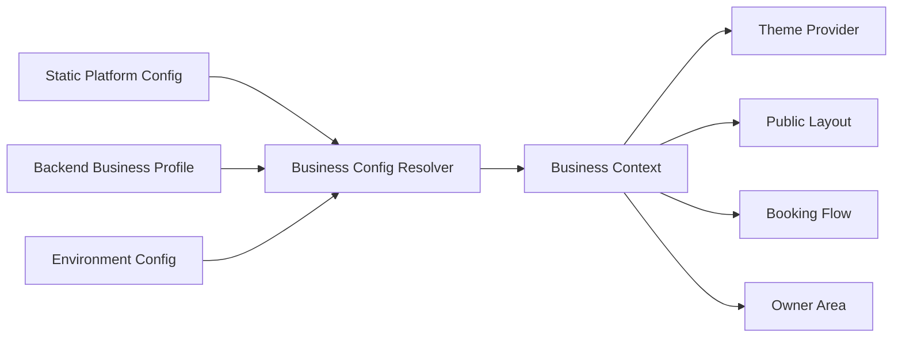

Rules:

- Pages import resolved business context, not raw config files.
- Shared UI components receive display props and do not know about business APIs.
- Feature components can use business hooks when business-aware behavior is required.
- API modules do not import theme or UI config.
- Business feature code owns profile fetching, config resolution, and future business management screens.

### Business Domain Modules

Frontend business domain should include:

- `features/business/profile`: runtime business profile query and profile type mapping.
- `features/business/configuration`: config defaults, resolver, and validation.
- `features/business/branding`: theme token adapter and logo/media handling.
- `features/business/contact`: contact display helpers and contact visibility rules.
- `features/business/rules`: booking and display rule helpers.
- `features/business/management`: future owner-facing business configuration screens.

### Feature Service Layer

Each feature should include a local service layer when it has business logic that is more complex than a direct API call.

Recommended feature structure:

```text
features/<feature>/
  api/             backend resource calls
  services/        feature orchestration and domain logic
  hooks/           query/mutation hooks and UI-facing state hooks
  components/      feature-specific UI
  schemas/         form and input validation
  types.ts         feature-specific types
```

Service layer responsibilities:

- Convert backend DTOs into UI-friendly view models.
- Compose multiple API calls for one feature workflow.
- Keep page components free of business orchestration logic.
- Keep shared API modules focused on transport, not feature behavior.
- Own feature-specific rules that are not global business rules.

Examples:

- `features/booking/services/booking-flow.service.ts`: derives booking steps, validates selected service/date/slot state, and prepares booking confirmation models.
- `features/business/configuration/services/business-config.service.ts`: resolves static config, runtime profile, contact visibility, and theme tokens.
- `features/auth/services/session.service.ts`: handles login/logout/refresh orchestration around the shared token adapter.
- `features/admin/appointments/services/appointment-calendar.service.ts`: maps appointments to future calendar events.

Rules:

- Components should call hooks, not services directly, unless the service is a pure utility.
- Hooks can call services to prepare data or execute workflows.
- Services can call feature API modules and shared utilities.
- Services must not import React components.
- Shared API client must not import feature services.

## Sitemap

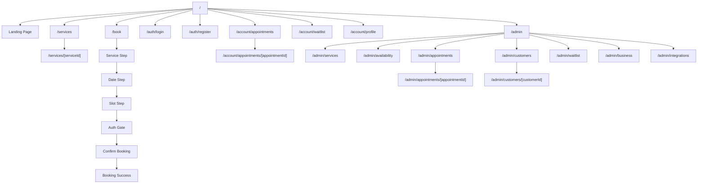

## Route Structure

### Public Routes

- `/`: Landing page.
- `/services`: Public service catalog.
- `/services/[serviceId]`: Service detail page.
- `/book`: Booking flow entry point.
- `/book/service/[serviceId]`: Optional service-prefilled booking flow.
- `/auth/login`: Customer/owner login.
- `/auth/register`: Customer registration.

### Customer Routes

- `/account/appointments`: Customer appointment list.
- `/account/appointments/[appointmentId]`: Customer appointment detail.
- `/account/waitlist`: Customer waitlist entries.
- `/account/profile`: Current user profile and session actions.

### Owner Routes

- `/admin`: Owner dashboard.
- `/admin/services`: Services management.
- `/admin/availability`: Availability management.
- `/admin/appointments`: Appointment calendar/list.
- `/admin/appointments/[appointmentId]`: Appointment detail.
- `/admin/customers`: Customer list.
- `/admin/customers/[customerId]`: Customer detail and history.
- `/admin/waitlist`: Waitlist overview.
- `/admin/business`: Business profile, contact details, branding.
- `/admin/integrations`: Calendar integration settings.

### Future Routes

These routes should be reserved in the product architecture but not implemented in Phase 1:

- `/account/notifications`: Customer notifications center.
- `/admin/notifications`: Owner notifications center.
- `/admin/analytics`: Analytics dashboard.
- `/admin/payments`: Payments management.
- `/admin/staff`: Staff members and employee scheduling.
- `/admin/resources`: Multiple calendars/resources.

### System Routes

- `/not-found`: Generic not found state.
- `/forbidden`: Authenticated but missing role.
- `/error`: Generic recoverable application error.

## Page Hierarchy

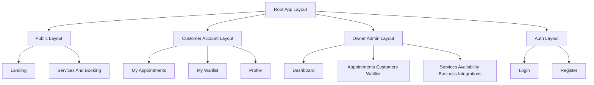

### Root Layout

Responsibilities:

- Load global styles.
- Register query client provider.
- Register auth/session provider.
- Register theme provider.
- Render route-level error boundaries.
- Avoid business-specific copy.

### Public Layout

Responsibilities:

- Render business-aware header.
- Render generic navigation.
- Render footer with contact details.
- Apply branding tokens from the business configuration model.

### Customer Account Layout

Responsibilities:

- Require authenticated session.
- Require `CUSTOMER` role for customer-only pages.
- Show account navigation.
- Preserve generic labels like "My appointments" and "Waitlist".

### Owner Admin Layout

Responsibilities:

- Require authenticated session.
- Require `OWNER` role.
- Show owner sidebar/topbar.
- Provide shared admin page shell, filters, empty states, and action areas.

## High-Level UX Planning

### Main Screen Hierarchy

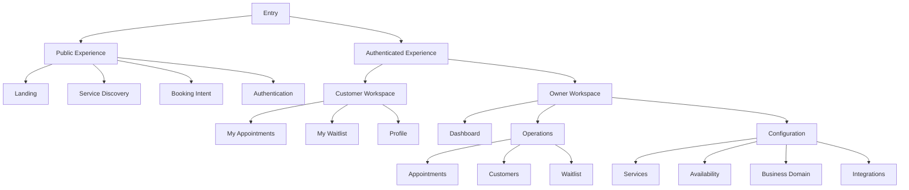

### Navigation Structure

Public navigation:

- Brand area: resolved business logo/name.
- Primary links: Services, Book.
- Secondary links: Login, My appointments when authenticated.
- Owner shortcut: Admin, only visible for `OWNER`.
- Footer: contact details, website, social links, generic platform links.

Customer account navigation:

- My appointments.
- My waitlist.
- Profile.
- Back to booking.
- Logout.

Owner/admin navigation:

- Dashboard.
- Appointments.
- Services.
- Availability.
- Customers.
- Waitlist.
- Business.
- Integrations.
- Future: Notifications, Analytics, Payments, Staff.

Navigation rules:

- Navigation items are generated from route configuration and permission metadata.
- Public components do not manually check roles except through shared route/nav helpers.
- Owner navigation can contain future-disabled items only if clearly hidden or marked as unavailable in product configuration.
- The route tree should remain stable even as screens evolve from placeholder shells to full features.

### Customer Booking Journey

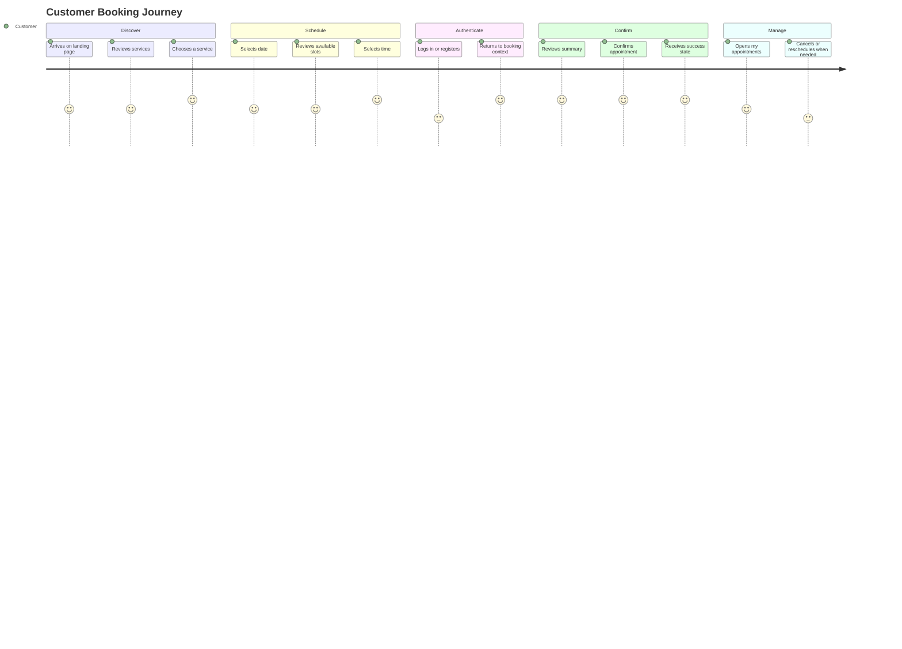

### Owner Management Journey

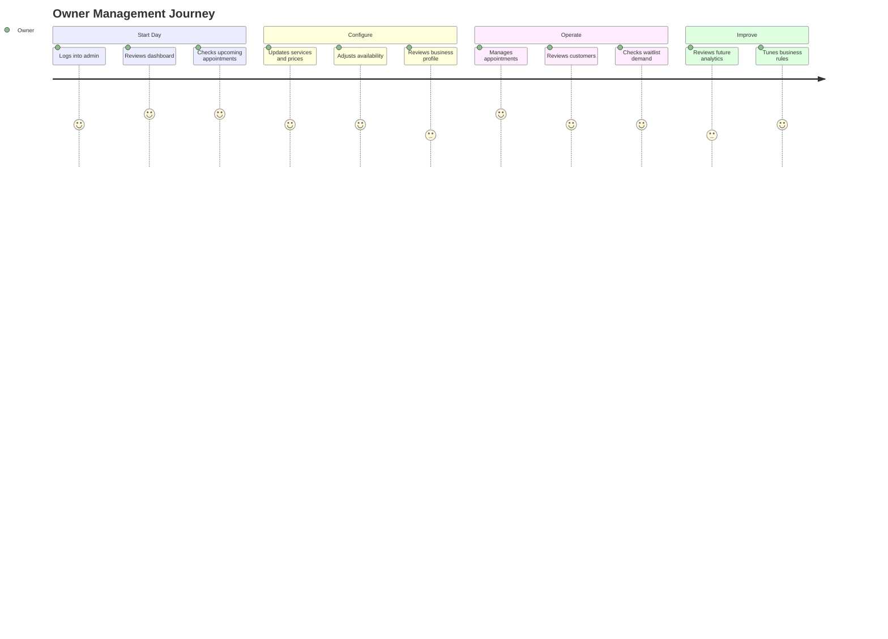

### Customer Journey Diagram

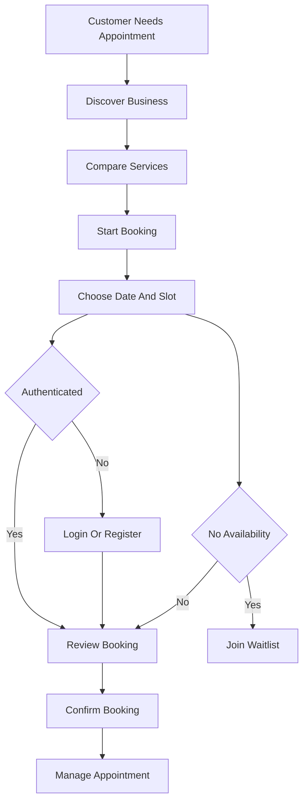

### Owner Journey Diagram

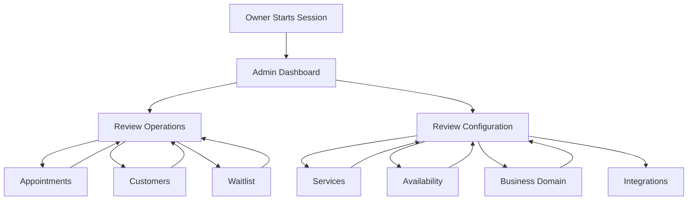

## Customer User Flows

### Browse And Book

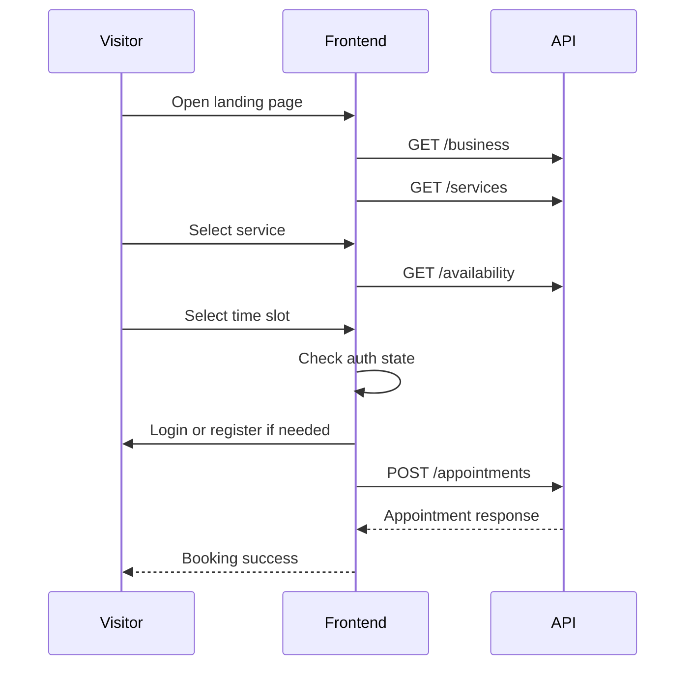

Flow requirements:

- Visitors can view services and availability before logging in.
- Authentication should happen only when confirming a booking.
- If no slots are available, the page should offer a waitlist path when the user is authenticated or prompt for auth first.
- Booking confirmation should summarize service, date, time, price, business contact info, and cancellation/reschedule guidance.

### Register

Steps:

1. User opens `/auth/register`.
2. User enters email, password, first name, last name, and optional phone.
3. Frontend validates fields with client-side schema.
4. Frontend calls `POST /auth/register`.
5. On success, tokens and user are stored in auth state.
6. User is redirected to the original intended action or to `/account/appointments`.

### Login

Steps:

1. User opens `/auth/login`.
2. User enters email and password.
3. Frontend calls `POST /auth/login`.
4. On success, user role determines redirect:
   - `CUSTOMER`: customer account or previous booking flow.
   - `OWNER`: `/admin`.

### Manage Appointments

Steps:

1. Customer opens `/account/appointments`.
2. Frontend calls `GET /me/appointments`.
3. Customer can filter upcoming/past/cancelled appointments.
4. Customer opens appointment detail.
5. Customer can cancel appointment.
6. Customer can begin reschedule flow by selecting a new date/time and submitting `PATCH /me/appointments/:id/reschedule`.

### Manage Waitlist

Steps:

1. Customer opens `/account/waitlist`.
2. Frontend calls `GET /me/waitlist`.
3. Customer sees active and historical entries.
4. Customer can cancel an active entry with `DELETE /me/waitlist/:id`.

## Owner User Flows

### Owner Login And Dashboard

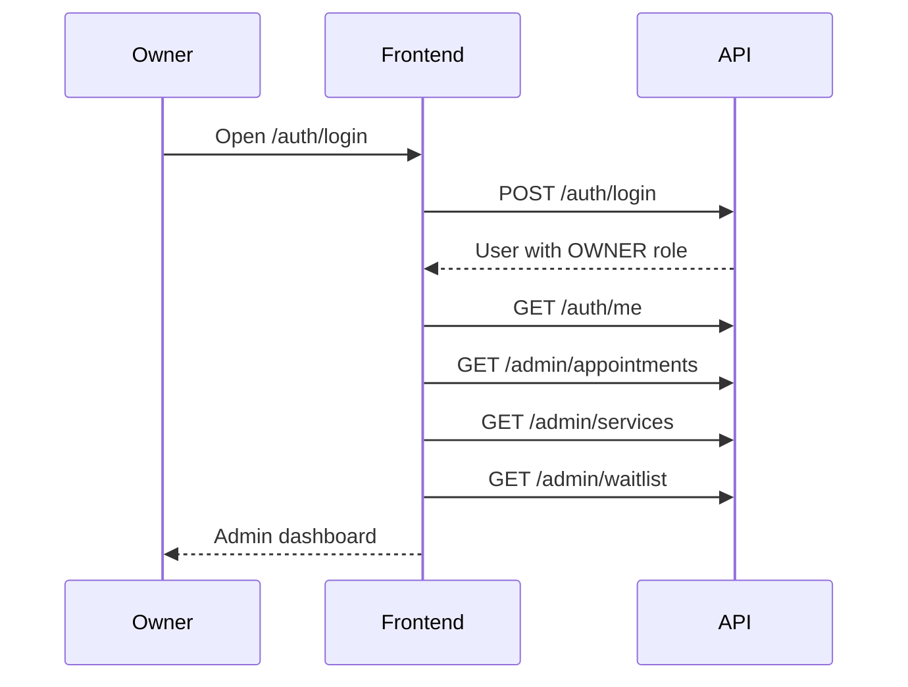

Dashboard requirements:

- Show upcoming appointments.
- Show service count and active/inactive summary.
- Show waitlist count.
- Show quick links to services, availability, appointments, customers, and business profile.

### Manage Services

Steps:

1. Owner opens `/admin/services`.
2. Frontend calls `GET /admin/services`.
3. Owner can create a service with name, description, duration, price, active status, and sort order.
4. Owner can edit existing service fields.
5. Owner can deactivate a service.
6. Public catalog should only show active services via `GET /services`.

### Manage Availability

Steps:

1. Owner opens `/admin/availability`.
2. Frontend loads weekly rules, date overrides, blocked times, and holidays.
3. Owner edits weekly opening windows.
4. Owner creates closed dates or custom date availability.
5. Owner creates blocked times.
6. Owner creates holidays.
7. Booking availability updates through backend slot calculation.

### Manage Appointments

Steps:

1. Owner opens `/admin/appointments`.
2. Frontend calls `GET /admin/appointments` with filters.
3. Owner can view appointment detail.
4. Owner can cancel an appointment.
5. Owner can edit internal notes.
6. Owner can switch between supported appointment presentation modes as they become available.

### Future Calendar View Support

Admin appointment management starts with a list/table presentation, but the architecture must support calendar scheduling views without refactoring the API layer or appointment domain.

Future view modes:

- Day view.
- Week view.
- Month view.

Calendar architecture requirements:

- Appointment data should be normalized into a shared `CalendarEvent` view model.
- Table and calendar views should consume the same appointment query hooks.
- Filters should be view-agnostic: status, date, from, to, service, customer where supported.
- Date range calculation belongs in a calendar utility layer, not in page components.
- View mode state should be route/query driven, for example `/admin/appointments?view=week&date=2026-06-22`.
- Calendar components should not call APIs directly.
- Calendar rendering should support future resources such as staff members, rooms, equipment, or multiple calendars.
- Appointment detail and mutation actions should be shared between table and calendar views.

Recommended future model:

```ts
export type AppointmentViewMode = "table" | "day" | "week" | "month";

export interface CalendarEvent {
  id: string;
  appointmentId: string;
  title: string;
  startAt: string;
  endAt: string;
  status: AppointmentStatus;
  serviceId: string;
  customerId: string;
  resourceId?: string;
  metadata?: Record<string, unknown>;
}
```

Future calendar module boundaries:

- `features/admin/appointments`: appointment API hooks, filters, actions, table view, detail panels.
- `features/calendar`: reusable calendar grid primitives, date range helpers, event layout utilities.
- `shared/lib/date-time`: timezone-safe formatting and range calculations.

Do not implement calendar views in Phase 1.

### Manage Customers

Steps:

1. Owner opens `/admin/customers`.
2. Frontend calls `GET /admin/customers` with search and pagination.
3. Owner opens customer detail.
4. Frontend calls `GET /admin/customers/:id`.
5. Owner sees contact info and appointment history.

### View Waitlist

Steps:

1. Owner opens `/admin/waitlist`.
2. Frontend calls `GET /admin/waitlist`.
3. Owner filters by service or status.
4. Owner reviews active demand for future scheduling decisions.

## Notifications Center Planning

The backend already contains notification-related functionality around booking and cancellation events. The frontend should reserve architecture for a future notifications center, but no notifications UI should be implemented in Phase 1.

### Customer Notifications

Future customer notification categories:

- Booking confirmations.
- Appointment reminders.
- Reschedule confirmations.
- Cancellation confirmations.
- Waitlist notifications.
- Waitlist availability alerts.

Customer notification surfaces:

- Future `/account/notifications` page.
- Header notification indicator.
- Booking success follow-up messaging.
- Appointment detail activity timeline.

### Owner Notifications

Future owner notification categories:

- New bookings.
- Customer cancellations.
- Reschedules.
- Waitlist activity.
- Calendar integration failures.
- Availability conflicts.

Owner notification surfaces:

- Future `/admin/notifications` page.
- Admin topbar notification indicator.
- Dashboard activity feed.
- Appointment detail activity timeline.

### Notification Architecture Requirements

- Notifications should be modeled as a dedicated feature, separate from appointments and waitlist.
- Notification UI should consume normalized notification view models, not backend event internals.
- Notification routing should be role-aware: customer notifications and owner notifications are separate surfaces.
- Notification preferences should belong to future business/user settings, not shared UI components.
- Notification delivery channels should be abstracted: email, SMS, WhatsApp, push, in-app.
- Existing backend notification behavior should not be assumed to include an in-app inbox until an API exists.

Recommended future model:

```ts
export type NotificationAudience = "CUSTOMER" | "OWNER";
export type NotificationChannel = "IN_APP" | "EMAIL" | "SMS" | "WHATSAPP" | "PUSH";
export type NotificationStatus = "UNREAD" | "READ" | "ARCHIVED";

export interface NotificationItem {
  id: string;
  audience: NotificationAudience;
  channel: NotificationChannel;
  title: string;
  message: string;
  status: NotificationStatus;
  createdAt: string;
  readAt?: string | null;
  relatedEntityType?: "APPOINTMENT" | "WAITLIST" | "SERVICE" | "BUSINESS";
  relatedEntityId?: string;
}
```

Do not implement notification center screens in Phase 1.

## Booking Flow Specification

The booking flow should be implemented as a guided wizard, but each step should be URL-addressable or restorable from state where practical.

### Booking State

The booking feature owns this state:

- Selected service ID.
- Selected date.
- Available slots for the selected service/date.
- Selected slot start time.
- Optional customer notes if backend support is added later.
- Auth redirect intent.
- Submission state.
- Booking result.

### Booking Steps

1. Select service.
2. Select date.
3. Select time slot.
4. Authenticate if needed.
5. Review booking.
6. Confirm booking.
7. Show success.

### Booking Rules

- Service list comes from `GET /services`.
- Availability comes from `GET /availability`.
- Slot display uses business timezone from `GET /business`.
- Booking submission calls `POST /appointments`.
- If the API returns conflict or unavailable slot, the frontend reloads availability and asks the user to choose again.
- If there are no slots, show waitlist CTA.
- Booking copy must stay generic and configurable.

### Booking Flow Diagram

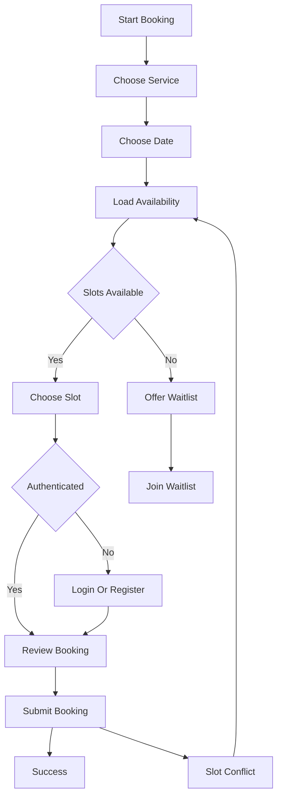

## Low Fidelity Wireframes

These wireframes define layout intent only. They are not final visual design.

### Public Landing Page

```text
+------------------------------------------------------+
| Logo / Business Name              Services  Book  Login |
+------------------------------------------------------+
|                                                      |
|  Generic hero title from config/business profile      |
|  Short description                                   |
|                                                      |
|  [Book an appointment]  [View services]              |
|                                                      |
+------------------------------------------------------+
| Featured services                                    |
| +----------------+ +----------------+ +-------------+ |
| | Service name   | | Service name   | | Service name| |
| | Duration/price | | Duration/price | | Duration    | |
| | [Book]         | | [Book]         | | [Book]      | |
| +----------------+ +----------------+ +-------------+ |
+------------------------------------------------------+
| How booking works                                    |
| 1. Choose service  2. Pick time  3. Confirm          |
+------------------------------------------------------+
| Contact details / address / social links             |
+------------------------------------------------------+
```

### Services Page

```text
+------------------------------------------------------+
| Header                                               |
+------------------------------------------------------+
| Services                                             |
| Search/filter area                                   |
|                                                      |
| +--------------------------------------------------+ |
| | Service name                         Price       | |
| | Description                                      | |
| | Duration                             [Book]      | |
| +--------------------------------------------------+ |
| +--------------------------------------------------+ |
| | Service name                         Price       | |
| | Description                                      | |
| | Duration                             [Book]      | |
| +--------------------------------------------------+ |
+------------------------------------------------------+
```

### Booking Wizard

```text
+------------------------------------------------------+
| Header                                               |
+------------------------------------------------------+
| Book appointment                                     |
| Step indicator: Service > Date > Time > Confirm      |
+------------------------------------------------------+
| Left: current step content                           |
| +--------------------------------------------------+ |
| | Service cards / Date picker / Time slots          | |
| +--------------------------------------------------+ |
|                                                      |
| Right: booking summary                               |
| +--------------------------------------------------+ |
| | Selected service                                  | |
| | Selected date/time                                | |
| | Price and duration                                | |
| | [Continue / Confirm]                              | |
| +--------------------------------------------------+ |
+------------------------------------------------------+
```

### Auth Page

```text
+------------------------------------------------------+
| Business logo/name                                   |
+------------------------------------------------------+
| +--------------------------------------------------+ |
| | Login or Create Account                           | |
| | Email                                             | |
| | Password                                          | |
| | [Submit]                                          | |
| | Switch login/register                             | |
| +--------------------------------------------------+ |
+------------------------------------------------------+
```

### Customer Appointments

```text
+------------------------------------------------------+
| Account navigation                                  |
+------------------------------------------------------+
| My appointments                                      |
| Filters: Upcoming / Past / Cancelled                 |
|                                                      |
| +--------------------------------------------------+ |
| | Service name                                      | |
| | Date/time                  Status                 | |
| | [Details] [Reschedule] [Cancel]                   | |
| +--------------------------------------------------+ |
+------------------------------------------------------+
```

### Owner Dashboard

```text
+------------------------------------------------------+
| Admin sidebar          | Topbar / Business name       |
+------------------------+-----------------------------+
| Dashboard              | Overview                    |
| Services               | +--------+ +--------+        |
| Availability           | | Today  | | Waitlist|       |
| Appointments           | +--------+ +--------+        |
| Customers              |                             |
| Waitlist               | Upcoming appointments       |
| Business               | +-------------------------+ |
| Integrations           | | Appointment row          | |
|                        | +-------------------------+ |
+------------------------+-----------------------------+
```

### Owner Services Management

```text
+------------------------------------------------------+
| Admin layout                                         |
+------------------------------------------------------+
| Services                                      [Add]  |
| Filters: All / Active / Inactive                     |
|                                                      |
| +--------------------------------------------------+ |
| | Name                  Duration    Price   Status  | |
| | [Edit] [Deactivate]                              | |
| +--------------------------------------------------+ |
+------------------------------------------------------+
| Slide-over or modal: Create/Edit service             |
+------------------------------------------------------+
```

### Owner Availability Management

```text
+------------------------------------------------------+
| Availability                                         |
| Tabs: Weekly Rules | Date Overrides | Blocked | Holidays |
+------------------------------------------------------+
| Weekly Rules                                         |
| +--------------------------------------------------+ |
| | Monday      Start time   End time   Active        | |
| | Tuesday     Start time   End time   Active        | |
| +--------------------------------------------------+ |
| [Save rules]                                         |
+------------------------------------------------------+
```

### Owner Appointment Management

```text
+------------------------------------------------------+
| Appointments                                         |
| Filters: Date / Status / Range                       |
+------------------------------------------------------+
| +--------------------------------------------------+ |
| | Time       Service       Customer       Status     | |
| | [View] [Cancel]                                  | |
| +--------------------------------------------------+ |
| Detail panel: service, customer, notes, actions       |
+------------------------------------------------------+
```

## Page Inventory

### Public Pages

- Landing page:
  - Loads business profile and active services.
  - Uses configurable hero, CTA, and image/content slots.
  - Links to service catalog and booking flow.

- Services page:
  - Lists active services.
  - Shows price, duration, description, and booking CTA.
  - Supports future search/filtering without requiring backend changes.

- Service detail page:
  - Shows one active service.
  - Shows description, duration, price, and direct booking CTA.
  - Uses generic copy.

- Booking page:
  - Runs booking wizard.
  - Loads services and availability.
  - Handles auth gate and booking submission.

- Login page:
  - Supports customer and owner login using same endpoint.
  - Redirects based on role and original intent.

- Register page:
  - Creates customer account.
  - Supports continuation into booking flow.

### Customer Pages

- My appointments:
  - Lists customer appointments.
  - Supports filters.
  - Provides cancel and reschedule entry points.

- Appointment detail:
  - Shows service, date/time, status, notes if available, and ICS download.
  - Provides cancel/reschedule actions when valid.

- My waitlist:
  - Lists current customer waitlist entries.
  - Allows cancelling active entries.

- Profile:
  - Shows current user information from `/auth/me`.
  - Provides logout action.

### Owner Pages

- Admin dashboard:
  - Operational overview.
  - Upcoming appointments.
  - Service and waitlist summary.
  - Quick links to management pages.

- Services management:
  - Lists all services including inactive.
  - Create, edit, deactivate services.

- Availability management:
  - Weekly rules.
  - Date overrides.
  - Blocked times.
  - Holidays.

- Appointment management:
  - List/calendar-ready view.
  - Detail panel/page.
  - Cancel appointment.
  - Edit owner notes.

- Customers:
  - Searchable/paginated list.
  - Customer detail with appointment history.

- Waitlist:
  - Read-only operational view.
  - Filter by service and status.

- Business settings:
  - Edit business name, description, contact details, timezone, social links.
  - Upload logo.
  - Future theme editing support.

- Integrations:
  - Google Calendar connection status.
  - Connect/disconnect actions.

## Component Inventory

### Shared UI Components

- `Button`
- `IconButton`
- `Input`
- `Textarea`
- `Select`
- `Checkbox`
- `Switch`
- `DateInput`
- `TimeInput`
- `Card`
- `Badge`
- `Alert`
- `Dialog`
- `Drawer`
- `Tabs`
- `DropdownMenu`
- `Table`
- `Pagination`
- `Skeleton`
- `Spinner`
- `EmptyState`
- `ErrorState`
- `PageHeader`
- `Section`
- `Breadcrumbs`
- `Price`
- `Duration`
- `StatusBadge`

### Layout Components

- `RootProviders`
- `PublicLayout`
- `AuthLayout`
- `AccountLayout`
- `AdminLayout`
- `PublicHeader`
- `AdminSidebar`
- `AdminTopbar`
- `Footer`
- `MobileNav`
- `ProtectedRoute`
- `RoleGate`

### Business Components

- `BusinessBrand`
- `BusinessLogo`
- `BusinessContactDetails`
- `BusinessHero`
- `BusinessThemeProvider`
- `BusinessSocialLinks`
- `BusinessConfigProvider`
- `BusinessProfileSummary`
- `BusinessContactCard`
- `BusinessBrandingPreview`
- `BusinessRulesSummary`
- `BusinessSettingsSection`

### Catalog Components

- `ServiceCard`
- `ServiceList`
- `ServiceDetail`
- `ServicePrice`
- `ServiceDuration`
- `ServiceStatusToggle`
- `ServiceForm`

### Booking Components

- `BookingWizard`
- `BookingStepIndicator`
- `ServiceStep`
- `DateStep`
- `TimeSlotStep`
- `BookingReview`
- `BookingSummary`
- `BookingSuccess`
- `TimeSlotGrid`
- `NoSlotsState`
- `WaitlistCta`

### Auth Components

- `LoginForm`
- `RegisterForm`
- `LogoutButton`
- `AuthRedirectNotice`
- `SessionMenu`

### Customer Components

- `AppointmentList`
- `AppointmentCard`
- `AppointmentDetail`
- `AppointmentActions`
- `RescheduleForm`
- `WaitlistEntryList`
- `WaitlistEntryCard`

### Owner Components

- `DashboardMetricCard`
- `UpcomingAppointmentsList`
- `AdminServiceTable`
- `AdminServiceForm`
- `AvailabilityRulesEditor`
- `DateOverrideEditor`
- `BlockedTimesTable`
- `HolidayList`
- `AdminAppointmentTable`
- `AdminAppointmentDetail`
- `AppointmentNotesForm`
- `AppointmentViewModeToggle`
- `AppointmentFilters`
- `CustomerTable`
- `CustomerDetailPanel`
- `AdminWaitlistTable`
- `BusinessProfileForm`
- `LogoUpload`
- `CalendarIntegrationPanel`

### Future Calendar Components

- `CalendarShell`
- `CalendarToolbar`
- `CalendarDayView`
- `CalendarWeekView`
- `CalendarMonthView`
- `CalendarEventCard`
- `CalendarEventPopover`
- `CalendarResourceColumn`
- `CalendarDateRangeNavigator`

These are future components only. Phase 1 should not implement calendar views.

### Future Notification Components

- `NotificationCenter`
- `NotificationList`
- `NotificationItem`
- `NotificationBadge`
- `NotificationPreferencesForm`
- `OwnerActivityFeed`
- `CustomerNotificationSettings`

These are future components only. Phase 1 should not implement a notifications center.

## Business Configuration Model

The frontend should use a dedicated business configuration model that merges static defaults with runtime backend data.

### Configuration Sources

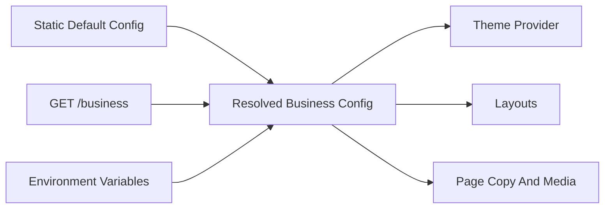

### Static Business Config Shape

```ts
export interface BusinessPlatformConfig {
  identity: {
    fallbackName: string;
    fallbackLogoUrl?: string;
    businessTypeLabel?: string;
  };
  theme: {
    colorScheme: "light" | "dark" | "system";
    primaryColor: string;
    secondaryColor?: string;
    backgroundColor?: string;
    textColor?: string;
    borderRadius: "none" | "sm" | "md" | "lg" | "xl";
    fontFamily?: string;
  };
  media: {
    heroImageUrl?: string;
    galleryImageUrls?: string[];
    placeholderImageUrl?: string;
  };
  content: {
    heroTitle?: string;
    heroSubtitle?: string;
    primaryCtaLabel?: string;
    secondaryCtaLabel?: string;
    servicesTitle?: string;
    bookingTitle?: string;
    noSlotsMessage?: string;
    waitlistCtaLabel?: string;
    footerText?: string;
  };
  contact: {
    showPhone: boolean;
    showEmail: boolean;
    showAddress: boolean;
    showWebsite: boolean;
    showSocialLinks: boolean;
  };
  settings: {
    locale: string;
    currency: string;
    timeFormat: "12h" | "24h";
    dateFormat: string;
    enablePublicServiceSearch: boolean;
    enableOwnerDashboard: boolean;
  };
  booking: {
    allowGuestAvailabilityPreview: boolean;
    requireAuthBeforeSlotSelection: boolean;
    requireAuthBeforeConfirmation: boolean;
    allowWaitlist: boolean;
    allowCustomerCancellation: boolean;
    allowCustomerReschedule: boolean;
    appointmentLeadTimeMinutes?: number;
    defaultTimezone?: string;
  };
  services: {
    showPrices: boolean;
    showDuration: boolean;
    showDescription: boolean;
    defaultSort: "sortOrder" | "price" | "duration" | "name";
  };
  rules: {
    cancellationPolicyText?: string;
    reschedulePolicyText?: string;
    privacyPolicyUrl?: string;
    termsUrl?: string;
  };
  management: {
    allowOwnerBrandingEdit: boolean;
    allowOwnerBusinessProfileEdit: boolean;
    allowOwnerBookingRulesEdit: boolean;
  };
}
```

### Runtime Business Profile Shape

Runtime data comes from `GET /business`:

```ts
export interface BusinessProfile {
  id: string;
  name: string;
  logoUrl?: string | null;
  description?: string | null;
  phone: string;
  email: string;
  address?: string | null;
  website?: string | null;
  socialLinks?: Record<string, string> | null;
  timezone: string;
  createdAt: string;
  updatedAt: string;
}
```

### Resolved Business Config Rules

- `business.name` overrides `identity.fallbackName`.
- `business.logoUrl` overrides `identity.fallbackLogoUrl`.
- `business.description` can populate hero subtitle when no custom content is configured.
- `business.timezone` overrides `booking.defaultTimezone`.
- Contact visibility is controlled by config, but contact values come from backend business profile.
- Service names, prices, descriptions, duration, active status, and sort order come from service APIs.
- Booking availability and rules come from backend availability APIs.
- Business settings define display and feature behavior; they do not bypass backend authorization.
- Business rules provide customer-facing policy text and future rule toggles; backend remains the source of enforceable booking rules.

### Business Data Boundaries

Allowed inside config:

- Branding defaults.
- Generic marketing copy.
- Theme tokens.
- Fallback images.
- Feature toggles.
- Display preferences.
- Policy text.
- Default locale, currency, and formatting preferences.

Not allowed inside config:

- Real service catalog if backend is available.
- Real appointment data.
- Real customer data.
- Role permissions that conflict with backend.
- Hardcoded assumptions about business category.
- Enforceable booking constraints that the backend does not support.

### Business Configuration Architecture

Business configuration should be resolved in one direction:

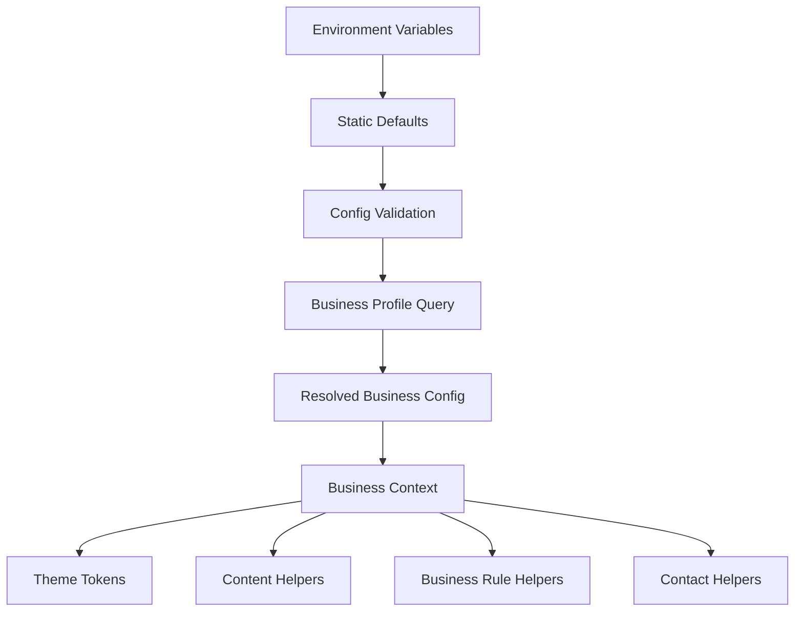

Architecture rules:

- `BusinessPlatformConfig` defines static platform defaults.
- `BusinessProfile` mirrors backend `/business`.
- `ResolvedBusinessConfig` is the only shape consumed by layouts and business-aware features.
- Theme tokens are derived from resolved config, then applied through CSS variables.
- Content helpers expose generic labels and copy.
- Rule helpers expose display and UX behavior only; backend APIs enforce real availability and booking constraints.
- Owner-facing business configuration management screens are planned for later phases and must use the same config model.

## Role-Based Routing And Permissions

### Permission Model

```ts
export type UserRole = "CUSTOMER" | "OWNER" | "STAFF";

export interface RoutePermission {
  requiresAuth: boolean;
  allowedRoles?: UserRole[];
  requiredPermissions?: PermissionKey[];
  redirectUnauthenticatedTo: string;
  redirectUnauthorizedTo: string;
}

export type PermissionKey =
  | "appointment:read"
  | "appointment:manage"
  | "availability:manage"
  | "service:manage"
  | "customer:read"
  | "waitlist:read"
  | "business:manage"
  | "integration:manage"
  | "analytics:read"
  | "payment:manage"
  | "staff:manage";
```

### Route Permission Rules

- Public routes allow all visitors.
- Auth routes redirect authenticated users based on role.
- Customer routes require `CUSTOMER`.
- Owner routes require `OWNER`.
- Staff routes are reserved for future backend support and should not be visible in Phase 1.
- Permissions should be represented as metadata even while the backend only supports role checks.
- Shared protected actions like logout require only authentication.
- API authorization errors should be handled globally and surfaced with clear UI messages.

### Future-Proof Role Model

Current backend roles:

- `CUSTOMER`.
- `OWNER`.

Reserved future frontend role:

- `STAFF`.

Role design:

- `CUSTOMER` owns self-service booking, appointment, profile, and waitlist flows.
- `OWNER` owns all business and operational management flows.
- `STAFF` should later support limited operational access, such as viewing assigned appointments or managing availability for themselves.

Permission design:

- Route metadata should support both `allowedRoles` and `requiredPermissions`.
- Phase 1 and current backend integration should enforce roles only.
- Future staff support can map role claims or backend permission claims to `PermissionKey`.
- Frontend permissions improve routing and UX but backend authorization remains authoritative.

Multi-business implication:

- Future permission checks may need `businessId`, `staffId`, or `resourceId` scope.
- The route permission model should be extendable with scoped permissions rather than hardcoded role checks inside components.

### Route Guard Behavior

- If no session exists, redirect to `/auth/login` with a return URL.
- If session exists but role is invalid, redirect to `/forbidden`.
- If token refresh fails, clear session and redirect to login.
- If an owner logs in from the customer login page, redirect to `/admin`.
- If a customer logs in during booking, return to the booking review step.

## Recommended Frontend Architecture

### Stack

- Next.js App Router.
- React.
- TypeScript with strict mode.
- Tailwind CSS with CSS variables.
- TanStack Query for server state.
- React Hook Form and Zod for forms.
- Lightweight auth state with React context or Zustand.
- npm for consistency with backend.

### Architecture Layers

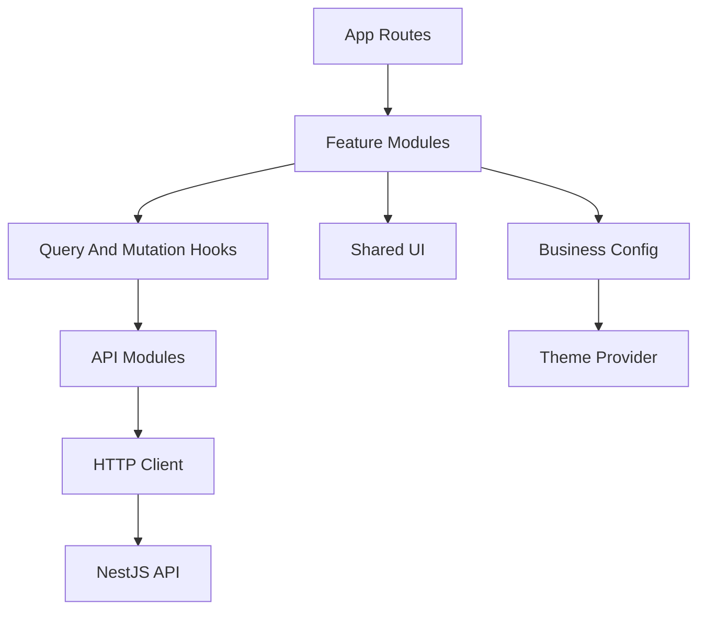

### Layer Responsibilities

- Routes:
  - Compose layouts and feature screens.
  - Handle metadata and route-level loading/error UI.
  - Avoid direct API calls except when server rendering is intentionally used.

- Features:
  - Own feature-specific components, forms, hooks, schemas, and page sections.
  - Import shared UI and shared API hooks.
  - Avoid leaking feature-specific state into global stores.

- Shared API:
  - Own HTTP client.
  - Own backend resource API functions.
  - Normalize backend errors.
  - Attach auth headers.
  - Refresh tokens when possible.

- Shared UI:
  - Own generic accessible components.
  - Know nothing about booking, services, or business category.

- Config:
  - Own static platform defaults.
  - Resolve runtime business profile with static defaults.
  - Expose theme tokens and content labels.

- Providers:
  - Own auth session.
  - Own query client.
  - Own resolved business theme.

## Final Folder Structure

```text
frontend/
  package.json
  next.config.ts
  tsconfig.json
  eslint.config.mjs
  tailwind.config.ts
  postcss.config.mjs
  .env.example
  README.md
  public/
    images/
      placeholders/
  src/
    app/
      layout.tsx
      page.tsx
      not-found.tsx
      error.tsx
      forbidden/
        page.tsx
      (auth)/
        auth/
          login/
            page.tsx
          register/
            page.tsx
      (public)/
        services/
          page.tsx
          [serviceId]/
            page.tsx
        book/
          page.tsx
          service/
            [serviceId]/
              page.tsx
      (account)/
        account/
          layout.tsx
          appointments/
            page.tsx
            [appointmentId]/
              page.tsx
          waitlist/
            page.tsx
          profile/
            page.tsx
          notifications/
            page.tsx
      (admin)/
        admin/
          layout.tsx
          page.tsx
          services/
            page.tsx
          availability/
            page.tsx
          appointments/
            page.tsx
            [appointmentId]/
              page.tsx
          customers/
            page.tsx
            [customerId]/
              page.tsx
          waitlist/
            page.tsx
          business/
            page.tsx
          integrations/
            page.tsx
          notifications/
            page.tsx
          analytics/
            page.tsx
          payments/
            page.tsx
          staff/
            page.tsx
    config/
      business-config.ts
      business-config.schema.ts
      routes.ts
      permissions.ts
      navigation.ts
      environment.ts
    features/
      auth/
        api/
        services/
        components/
        hooks/
        schemas/
        types.ts
      business/
        profile/
          api/
          hooks/
          services/
          types.ts
        configuration/
          defaults.ts
          resolver.ts
          schema.ts
          services/
          types.ts
        branding/
          theme-tokens.ts
          media.ts
          services/
        contact/
          contact-helpers.ts
        rules/
          booking-rules.ts
          display-rules.ts
        management/
          components/
      catalog/
        api/
        services/
        components/
        hooks/
        schemas/
      availability/
        api/
        services/
        components/
        hooks/
        schemas/
      booking/
        components/
        hooks/
        schemas/
        services/
        state/
        types.ts
      appointments/
        api/
        services/
        components/
        hooks/
        schemas/
      waitlist/
        api/
        services/
        components/
        hooks/
        schemas/
      notifications/
        api/
        services/
        components/
        hooks/
        types.ts
      calendar/
        components/
        hooks/
        lib/
        types.ts
      admin/
        dashboard/
        services/
        availability/
        appointments/
        customers/
        waitlist/
        business/
        integrations/
        notifications/
        analytics/
        payments/
        staff/
    shared/
      api/
        client.ts
        errors.ts
        endpoints.ts
        query-keys.ts
        tokens.ts
        token-storage.ts
      providers/
        app-providers.tsx
        auth-provider.tsx
        business-provider.tsx
        query-provider.tsx
        theme-provider.tsx
      ui/
        button.tsx
        input.tsx
        card.tsx
        dialog.tsx
        table.tsx
        empty-state.tsx
        error-state.tsx
        status-badge.tsx
      hooks/
      lib/
        date-time.ts
        format.ts
        routes.ts
        storage.ts
        cn.ts
        permissions.ts
      types/
        api.ts
        common.ts
    styles/
      globals.css
```

Phase 1 should create only the foundation subset needed for setup, routing, layouts, configuration, auth, API, state, and shared UI. Future folders such as notifications, calendar, analytics, payments, and staff can be represented in architecture documentation and route configuration, but should not receive real feature implementation in Phase 1.

## API Type Inventory

Frontend types should mirror backend contracts:

- `AuthUser`
- `AuthResponse`
- `BusinessProfile`
- `Service`
- `AvailabilitySlot`
- `Appointment`
- `WaitlistEntry`
- `CustomerSummary`
- `CustomerDetails`
- `AvailabilityRule`
- `DateAvailability`
- `BlockedTime`
- `Holiday`
- `CalendarIntegrationStatus`
- `ApiErrorEnvelope`
- `PaginatedResponse<T>`

Enums:

- `UserRole`: `CUSTOMER`, `OWNER`.
- `AppointmentStatus`: `CONFIRMED`, `CANCELLED`, `COMPLETED`.
- `WaitlistStatus`: `ACTIVE`, `NOTIFIED`, `FULFILLED`, `CANCELLED`.

## Data Fetching Strategy

### Public Data

- Business profile should be loaded early because it controls branding and timezone.
- Services should be cached and reused across landing, catalog, and booking.
- Availability should be queried by `serviceId` and `date`, with short cache time because it can change.

### Authenticated Customer Data

- Current user should be loaded on app startup when tokens exist.
- Customer appointments should be invalidated after booking, cancellation, or reschedule.
- Customer waitlist should be invalidated after join or cancel.

### Owner Data

- Admin services should be invalidated after create, update, or deactivate.
- Admin appointments should be invalidated after cancel or notes update.
- Availability-related queries should be invalidated after any rule, override, blocked time, or holiday mutation.
- Customer list should use search and pagination query keys.

## Error And Empty State Strategy

Error states should be generic and reusable:

- Validation error: show field-level messages when possible.
- Auth error: clear session if refresh fails, then redirect to login.
- Forbidden error: redirect to `/forbidden`.
- Not found: show resource-specific but generic empty message.
- Conflict error during booking: reload availability and ask user to choose another slot.
- Network error: show retry action.

Empty states:

- No services: public page should explain that services are not available yet.
- No slots: show waitlist CTA if enabled.
- No appointments: show CTA to book.
- No waitlist entries: show CTA to browse services.
- No customers: owner page should show neutral empty state.

## Future Features

These features are not part of Phase 1. The architecture should avoid blocking them.

### Calendar View

Future admin appointment calendar modes:

- Day view.
- Week view.
- Month view.

Architecture requirement: appointment data should map to a reusable `CalendarEvent` model so table and calendar views share filters, queries, and appointment actions.

### Notifications Center

Future notification surfaces:

- Customer notifications center.
- Owner notifications center.
- Header/topbar unread indicators.
- Dashboard activity feed.

Architecture requirement: notifications should be a dedicated feature module with audience-aware routing and future support for in-app, email, SMS, WhatsApp, and push channels.

### Analytics Dashboard

Future analytics areas:

- Booking volume.
- Revenue estimates if payments are added.
- Service popularity.
- Cancellation and waitlist trends.
- Customer retention.

Architecture requirement: analytics should be an owner-only feature module and should not mix reporting logic into operational appointment/service components.

### Payments

Future payment areas:

- Deposits.
- Full payment before booking.
- Refund tracking.
- Payment status on appointments.
- Owner payment settings.

Architecture requirement: payment UI should be isolated in a payments feature and appointment screens should consume payment status through typed contracts rather than payment provider internals.

### Multi-Business Support

Future multi-business areas:

- Business selector.
- Business-specific routing.
- Tenant-aware API calls.
- Per-business branding and rules.

Architecture requirement: the single-business `ResolvedBusinessConfig` should be designed so it can later become tenant-scoped without rewriting UI components.

### Staff Members

Future staff areas:

- Staff profiles.
- Staff service assignment.
- Staff availability.
- Appointment assignment.

Architecture requirement: staff should be modeled separately from customers and owners.

### Employee Scheduling

Future scheduling areas:

- Employee working hours.
- Time off.
- Assignment rules.
- Staff-specific booking availability.

Architecture requirement: availability and calendar modules should support future resource dimensions.

### Multiple Calendars And Resources

Future resource areas:

- Rooms.
- Equipment.
- Multiple calendars.
- Service/resource requirements.

Architecture requirement: calendar components should support optional `resourceId` and resource grouping.

### SMS Notifications

Future SMS requirements:

- Customer reminders.
- Owner booking alerts.
- Opt-in/opt-out preferences.

Architecture requirement: SMS should be a notification channel, not a separate notification domain.

### WhatsApp Notifications

Future WhatsApp requirements:

- Booking confirmations.
- Reminders.
- Waitlist alerts.

Architecture requirement: WhatsApp should reuse notification preferences and templates where possible.

### Push Notifications

Future push requirements:

- Browser push.
- Mobile app push if a mobile client is added.
- Real-time admin alerts.

Architecture requirement: push should be modeled as a notification channel and should not be coupled to current email notification behavior.

## Before Coding Architecture Checkpoint

Before generating frontend code, these architecture decisions must be reviewed and approved.

### 1. Final Folder Structure

Use the `Final Folder Structure` section above as the target architecture. Phase 1 should create only the foundation subset:

- App setup files.
- Root route files.
- Public/account/admin layout shells.
- Config files.
- Auth foundation files.
- API client foundation files.
- Business configuration resolver files.
- Shared providers.
- Shared UI primitives.
- Shared types/utilities.

Phase 1 should not create real business management screens, calendar screens, notification screens, analytics screens, payment screens, staff screens, or complete owner feature implementations.

### 2. Final Route Tree

```text
/
  services/
    [serviceId]/
  book/
    service/
      [serviceId]/
  auth/
    login/
    register/
  account/
    appointments/
      [appointmentId]/
    waitlist/
    profile/
    notifications/        future
  admin/
    services/
    availability/
    appointments/
      [appointmentId]/
    customers/
      [customerId]/
    waitlist/
    business/
    integrations/
    notifications/        future
    analytics/            future
    payments/             future
    staff/                future
    resources/            future
  forbidden/
  not-found
  error
```

Phase 1 may define route metadata and layout architecture for these areas, but should only implement generic foundation shells.

### 3. Business Configuration Model

Final model layers:

- `BusinessPlatformConfig`: static frontend defaults.
- `BusinessProfile`: backend `/business` profile response.
- `ResolvedBusinessConfig`: merged runtime shape used by layouts and features.
- `BusinessThemeTokens`: CSS-variable-ready theme tokens.
- `BusinessRules`: display and UX rules for booking behavior.
- `BusinessContactConfig`: contact visibility and formatted contact data.

The source of truth split:

- Backend owns real business profile, services, prices, availability, and enforceable booking rules.
- Frontend config owns defaults, presentation rules, generic copy, theme tokens, and feature display toggles.
- Resolved config owns the final UI-ready business context.

### 4. Business Configuration Architecture

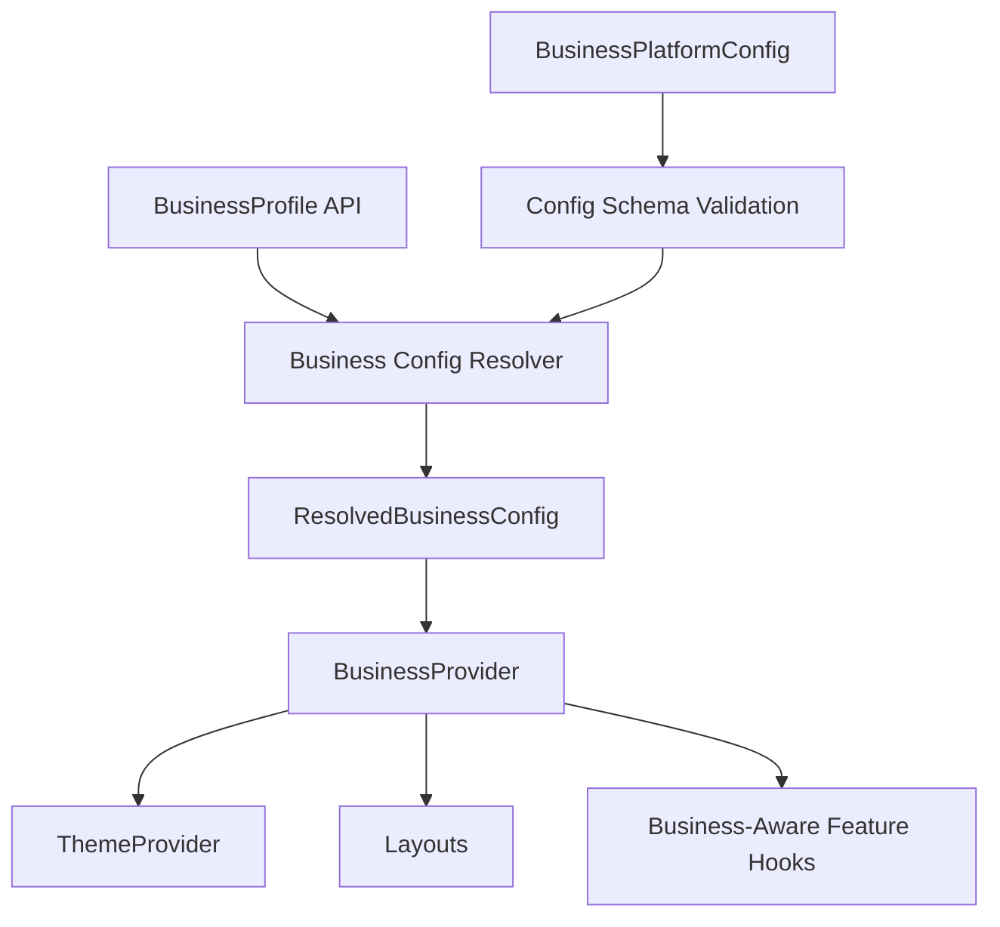

Implementation rule: pages and UI components should not manually merge business config. They consume resolved context or explicit props.

### 5. Authentication Architecture

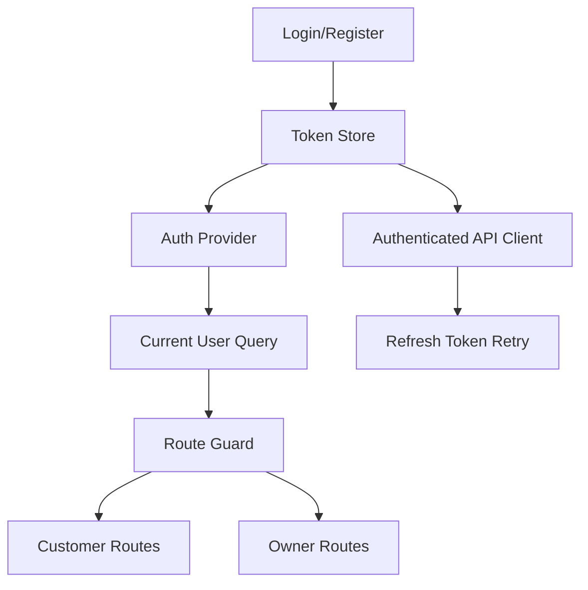

Authentication rules:

- `POST /auth/login` and `POST /auth/register` establish session state.
- `GET /auth/me` validates current user.
- Access token is attached to protected API calls.
- Refresh token is used for a single retry after 401.
- Failed refresh clears session and redirects to login.
- Role-aware redirects send customers to account/booking context and owners to `/admin`.

### Authentication Token Storage Strategy

Preferred production strategy:

- Store refresh token in an HttpOnly, Secure, SameSite cookie.
- Keep access token short-lived.
- Refresh access token through a backend endpoint that reads the HttpOnly cookie.
- Avoid exposing refresh tokens to browser JavaScript.
- Use CSRF protection if cookie-based authenticated mutations are introduced.

Current backend-compatible strategy:

- The current backend returns `accessToken` and `refreshToken` in JSON responses.
- Until backend cookie support exists, the frontend should isolate token storage behind a `TokenStorage` adapter.
- The adapter should make it possible to replace local/browser storage with cookie-backed session behavior later.
- Access token can be held in memory where practical.
- Refresh token storage is a temporary compromise and should be documented as replaceable.

Recommended abstraction:

```ts
export interface TokenStorage {
  getAccessToken(): string | null;
  setAccessToken(token: string | null): void;
  getRefreshToken(): string | null;
  setRefreshToken(token: string | null): void;
  clear(): void;
}
```

Future backend cookie support would replace the refresh-token methods with no-op or cookie-aware behavior while preserving the rest of the auth architecture.

Phase 1 should implement the auth foundation, route guards, token abstraction, and session provider, but not full polished auth product flows beyond foundation screens.

### 6. State Management Architecture

State categories:

- Server state: TanStack Query.
- Auth/session state: dedicated auth provider or lightweight store.
- Business config state: business provider derived from static config and business profile query.
- UI state: component-local state where possible.
- Booking wizard state: feature-local state in later Phase 2.
- Admin filters/table state: route query params or feature-local state in later Phase 3.

Rules:

- Do not store server data in global client state.
- Do not store business config separately in multiple places.
- Do not make shared UI components aware of global stores.
- Use query keys that match backend resources.

### 7. API Layer Architecture

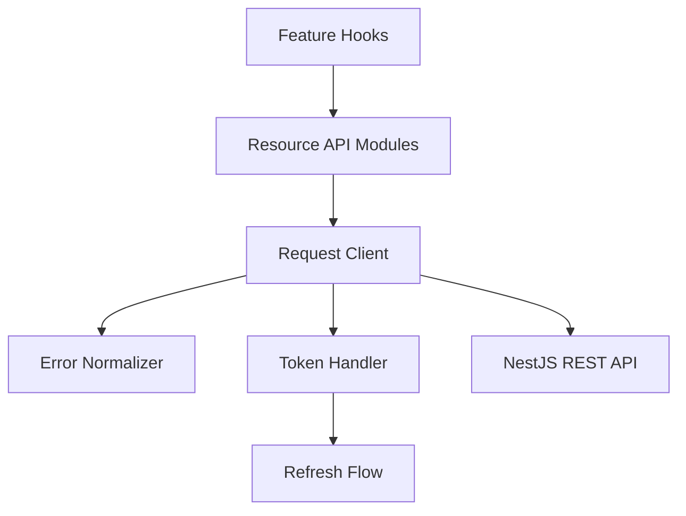

API layer rules:

- `shared/api/client.ts` owns fetch behavior.
- `shared/api/errors.ts` owns backend error envelope parsing.
- `shared/api/endpoints.ts` owns endpoint paths.
- Feature API modules expose intent-based functions.
- Feature hooks own query keys, invalidation, and mutation behavior.
- Components never call `fetch` directly.

### 8. Theme And Customization Architecture

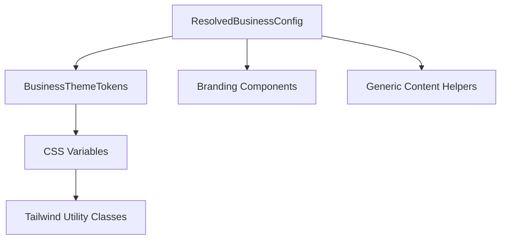

Theme rules:

- Use CSS variables as the theme bridge.
- Tailwind classes provide structure and spacing.
- Business colors and radius come from resolved config.
- Logo and media come from backend profile or static config fallbacks.
- Page copy uses generic content keys and never hardcodes a business category.
- Future owner branding screens should update the same model rather than introducing a second theme system.

## Implementation Phases

### Phase 1: Product Foundation

Goal: create the frontend application foundation only. Phase 1 establishes architecture and shared infrastructure; it does not implement real business, customer booking, or owner management functionality.

Includes:

- Next.js application setup.
- Routing architecture.
- Layout architecture.
- Theme/configuration system.
- Business configuration resolver foundation.
- Authentication foundation.
- API client layer.
- State management foundation.
- Shared UI foundation.
- Role-based routing foundation.
- Generic placeholder route shells only where needed to validate layout and guard behavior.

Explicitly excluded from Phase 1:

- Real business management screens.
- Real landing page content.
- Real services UI.
- Real booking flow.
- Real customer appointment UI.
- Real owner dashboard.
- Real owner services management.
- Real owner availability management.
- Real appointment management.
- Real customers UI.
- Real waitlist UI.
- Calendar views.
- Notifications center.
- Analytics, payments, staff, resources, or multi-business features.

### Phase 2: Customer Booking Experience

Goal: complete the customer-facing booking and account flow.

Includes:

- Landing page.
- Services list/detail.
- Booking wizard.
- Login/register.
- My appointments.
- My waitlist.

### Phase 3: Owner Admin Console

Goal: complete business management features.

Includes:

- Dashboard.
- Services management.
- Availability management.
- Appointment management.
- Customer management.
- Waitlist overview.
- Business profile and logo.
- Calendar integration page.

### Phase 4: Polish And Hardening

Goal: improve production readiness.

Includes:

- Accessibility pass.
- Responsive QA.
- Loading and error state audit.
- Form validation audit.
- Build/lint/test verification.
- README and architecture documentation.

## Decisions To Approve Before Implementation

- Use Next.js App Router as the frontend framework.
- Use Tailwind CSS with CSS variables for theming.
- Use TanStack Query for server state.
- Use React Hook Form and Zod for forms.
- Start with a single frontend app under `frontend/`, not a repo-wide monorepo.
- Include route architecture for both customer and owner areas from the beginning.
- Implement only the Phase 1 foundation after this specification is approved.
- Defer customer booking implementation to Phase 2.
- Defer full owner/admin implementation to Phase 3.
- Use config plus `GET /business` as the business customization model.
- Use a Next.js rewrite/proxy for local API calls unless backend CORS is added later.

## Non-Goals For Initial Approval

- No frontend code generation yet.
- No visual branding for a specific business.
- No hardcoded salon, clinic, barber, or consultant copy.
- No payment flow.
- No marketplace or multi-tenant routing.
- No CMS.
- No backend API redesign unless a blocking frontend issue is found.
- No business screens in Phase 1.
- No real business functionality in Phase 1.
- No real customer booking functionality in Phase 1.
- No real owner/admin management functionality in Phase 1.

## Approval Checkpoint

Implementation should not begin until this product structure is approved.

After approval, the first coding step should be Phase 1 only: scaffold the app and add the routing, layout, theme/configuration, auth, API client, state management, shared UI, and role-based routing foundations. Do not create business screens or real business functionality in Phase 1.
